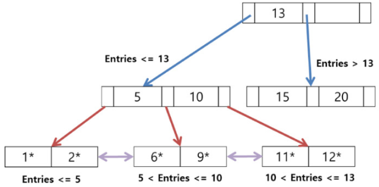

# CS study : 06 DB index

> [Interview_Question_for_Beginner](https://github.com/JaeYeopHan/Interview_Question_for_Beginner)/**Database**/
>
> [[데이터베이스] 인덱스 개념](https://ssoonidev.tistory.com/12)

- 위 repository 를 읽고 정리한 글입니다.

## 인덱스 Index 

### 정의

> 인덱스는 말 그대로 책의 맨 처음 또는 맨 마지막에 있는 ***색인***이라고 할 수 있다.
>
>  DBMS 도 데이터베이스 테이블의 모든 데이터를 검색해서 원하는 결과를 가져 오려면 시간이 오래 걸린다. 그래서 칼럼의 값과 해당 레코드가 저장된 주소를 키와 값의 쌍으로 인덱스를 만들어 두는 것이다.
>
> DBMS 의 인덱스는 항상 정렬된 상태를 유지하기 때문에 원하는 값을 탐색하는데는 빠르지만 새로운 값을 **추가하거나 삭제, 수정하는 경우에는 쿼리문 실행 속도가 느려진다**. 결론적으로 DBMS 에서 인덱스는 데이터의 저장 성능을 희생하고 그 대신 데이터의 읽기 속도를 높이는 기능이다. 
>
> SELECT 쿼리 문장의 WHERE 조건절에 사용되는 칼럼이라고 전부 인덱스로 생성하면 데이터 저장 성능이 떨어지고 인덱스의 크기가 비대해져서 오히려 역효과만 불러올 수 있다.

장점

1. 조건 검색 Where 절의 효율성
2. 정렬 Ordery By 절의 효율성
3. MIN, MAX 의 효율적인 처리 

단점

1. 인덱스를 관리하기 위해 DB의 약 10%에 해당하는 저장공간이 필요하다.
2. 정렬된 상태를 계속 유지해야 하기 때문에, 관리를 위한 추가작업이 필요하다. 
3. CREATE, DELETE, UPDATE가 빈번한 속성에 인덱스를 걸게 되면 인덱스의 크기가 비대해져서 성능이 오히려 저하되는 역효과가 발생할 수 있다.
4. 컬럼을 이루고 있는 데이터의 형식에 따라서 인덱스의 성능이 악영향을 미칠 수 있다

### 자료구조 

#### B+ Tree 인덱스 알고리즘

DB의 인덱스를 위해 자식 노드가 2개 이상인 B-Tree를 개선시킨 자료구조이다.

- 리프노드(데이터노드)만 인덱스와 함께 데이터(Value)를 가지고 있고, 나머지 노드(인덱스노드)들은 데이터를 위한 인덱스(Key)만을 갖는다.
- 리프노드들은 LinkedList로 연결되어 있다.
- 데이터 노드 크기는 인덱스 노드의 크기와 같지 않아도 된다.

그 외 장점

1. leaf node를 제외하고 데이터를 저장하지 않기 때문에 메모리를 더 확보할 수 있다. 따라서 하나의 node에 더 많은 포인터를 가질 수 있기 때문에 트리의 높이가 더 낮아지므로 검색 속도를 높일 수 있다. 

2. Full scan을 하는 경우 B+Tree는 leaf node에만 데이터가 저장되어 있고, leaf node끼리 linked list로 연결되어 있기 때문에 선형 시간이 소모된다. 반면 B-Tree는 모든 node를 확인해야 한다. 

#### Hash 인덱스 알고리즘

칼럼의 값으로 해시 값을 계산해서 인덱싱하는 알고리즘으로 매우 빠른 검색을 지원한다. 

하지만

1.  해시가 등호(=) 연산에만 특화되었기 때문에, 해시 값이 1이라도 달라지면 완전히 다른 해시 값을 생성하므로, 부등호 연산이 자주 사용되는 데이터베이스 검색에서는 적합하지 않다. 

2. 값을 변형해서 인덱싱하므로, 특정 문자로 시작하는 값으로 검색을 하는 전방 일치와 같이 값의 일부만으로 검색하고자 할 때는 해시 인덱스를 사용할 수 없다.

주로 메모리 기반의 데이터베이스에서 많이 사용한다.

### B+ Tree vs Hash 

데이터베이스의 인덱스 컬럼은 부등호를 이용한 순차 검색 연산이 자주 발생될 수 있다. 이러한 이유로 B-Tree의 리프노드들을 LinkedList로 연결하여 순차검색을 용이하게 하는 등 B-Tree를 인덱스에 맞게 최적화하였다.

### etc

`clustered index` vs `non-clustered index`

Clustered Index가 단일 포인터라면 Non-Clustered Index는 이중 포인터인 셈입니다. 

`primary key` & `secondary key `

특정 데이터를 찾기 위해서는 Secondrary Key에서 PK를 찾고, 그 PK를 통해 다시 원하는 데이터로 찾아가는 형태

