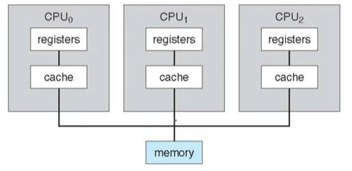
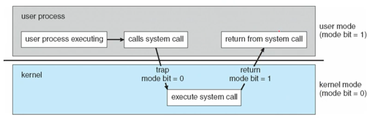
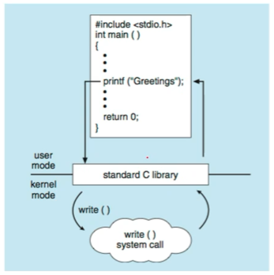

# OS01 : Intro & O/S Structures

[인프런 **운영체제 공룡책 강의**](https://www.inflearn.com/course/%EC%9A%B4%EC%98%81%EC%B2%B4%EC%A0%9C-%EA%B3%B5%EB%A3%A1%EC%B1%85-%EC%A0%84%EA%B3%B5%EA%B0%95%EC%9D%98/dashboard) 를 듣고 정리한 내용입니다. 

## INTRO 

**What is OS**

- Windows, Linux, Mac 

> An operatgin system is a software that operates a "computer" system.
>
> A computer is a machine that processes the "information" 

**What is information?**

> An information can be defined as a quatitative representation that measures the uncertainty.
>
>  `I(x) = -log2P(x)` 

- 정보의 최소 단위 : bit (binary digit) 	
- 정보의 처리 : 정보의 상태 변환 ( 0 => 1 , 1 => 0) by NOT, AND, OR 
  - by transistor
  - logic gate : NOT, AND, OR, XOR, NAND, NOR
  - logic 회로 : IC, LSI, VLSI, ULSI, SoC, 
    - 무어의 법칙, 황의 법칙 
- 정보의 저장과 전송 : 플립-플롭, 데이터 버스, RF 

**How Computer process information**

- 덧셈 : 반가산기, 전가산기
- 뺄셈 : 2의 보수 표현법
- 곱셈과 나눗셈 : 덧셈과 뺄셈의 반복 
- 실수 연산 : 부동 소수점 표현법
- 함수 : GOTO (if & for loop)

**컴퓨터는 만능인가?**

-  범용성 : university 
  - NOT, AND, OR 게이트만으로 모든 계산을 할 수 있다. 
  - NAND 게이트만으로 모든 계산을 할 수 있다. 
  - 범용 컴퓨터 : general purpose computer 
- 계산가능성 : computability 
  - Turing-computable : 튜링 머신으로 계산가능한 것 
  - 정지 문제 Halting Problem : 튜링 머신으로 풀 수 없는 문제 

**Computer**

made by Alan Turing & John Von Neumann(ISA)

- Alan Turing

  - Head, Tape, Turing Machines, Universal Turing Machine

  		- CPU, RAM, Application Programs, Operating System 에 대응

- John Von Neumann 

  - 내장형 프로그램 도입

  > "Stored program" computer is a computer that stores programs in a memory 

  		- CPU - bus - RAM 
  	
  		- CPU fetch & execute  => 폰 노이만 아키텍쳐 ISA (Instruction Set Architecture)

**What is program**

> A program is a set of "instructions" that tells a computer's hardware to perform a task 

**Is OS a program?**

- Operating System is a program running at all times on the computer 

  - to provide "system services" to application programs 

    - to manage "processes", resources, user interfaces, and so on.

****

## O/S Structures 

### 1.1 What Operating Systems Do

> An operating system is a software that manages a computer's hardware.
>
> It also provides a basis from application programs and acts as an "intermediary" between  the computer user and the computer hardware.

**Computer system roughly into 4 components** 

- hardware
- operating system
- application programs
- users 

**Defining Operating System** 

- there are _NO_ universally accepted definition of an operating system.
- A more common definitions is that 
  -  "the one program running at all times on the computer"
  - usually called the kernel
- Along with the kernel, there are two other types of programs
  - system programs
  - application programs

**A classical computer system consist of**

- one or more CPUs 
- a number of device controllers(disk, USB, graphics adapter) connected through a common "bus"
- memory 

### 1.2 Computer-System Organization

- booting 시, memory 의 EPRoM 에 저장된 명령어를 가져온다. 

**A bootstrap program is** 

- the first program to run on computer power-on
- and then loads the operating system 
- 하드디스크에 존재하는 운영체제(kernel)를 메모리에 로딩하는 일을 해주어야 한다. 

**Interrupts**

- Hardware may trigger an interrupt at any time
- by sending a signal to the CPU, usually by way of the system bus 
- I/O device => I/O request => transfer done => CPU gets I/O interrupt processing

**von Neumann architecture** 

- A typical instruction-execution cycle
  - first _fetches_ an instruction cycle from memory 
  - and stores that _instruction_ in the _instruction register_
- The instruction is then decoded
  - and may cause operands to be fetched from memory 
  - and stored in some internal register
- After the instruction on the operands 
  - has been _executed_,
  - the result may be stored back in memory 

**Storage-device hierarchy**

- The wide variety of storage systems can be organized in aa hierarchy according to:
  - storage capacity & access time

 

**I/O Structure**

- A large portion of OS code is dedicated to managing I/O

 

- DMA (Direct Memory Access)

### 1.3 Computer System Architecture

**Definition of Computer System Components**

- CPU : The hardware that executes instructions
- Processor : A physical ship that contains one or more CPUs.
- Core : The back computation unit of the CPU
- Multicore : Including multiple computing cores on the same CPU.
- Multiprocessor : Including multiple processors 

**Symmetric multiprocessing (SMP)**

- The most common multiprocessor systems, in which each peer CPU processor performs all tasks.
- Asymmetric multiprocessing => each processor is assigned a specific task. 

 

**Multi-core design**

- with several cores on the same processor chip

 

### 1.4 Operating System Operations

**Multi programming**

- runs more than one program at a time 
- keeps several processes in memory simultaneously
- to increase CPU utilization 

 

**Multitasking (=multiprocessing) (=concurrency)**

- a logical extension of multiprogramming
  - in which CPI switches jobs so frequently that 
  - users can interact with each job while it is running.
- => time sharing 
- CPU scheduling
  - If several processes are ready to run at the same time,
  - the system must choose which process will run next

**two seperate mode of operations**

- user mode & kernel mode
  - to ensure that an incorrect program cannot cause other programs to execute incorrectly

- transition from user to kernel mode!

****

****

### 1.7 Virtualization 

- a technology that allow us 
  - to abstract the hardware of a single computer
  - into several different execution environment
- VMM : Virtual Machine Manager 
  - VMware, XEN, SWL, and so on 
  - 여러 개의 OS 를 스케쥴링 하여 동시에 사용하자.

 

### 1.10 Computing Environment

- Operating Systems in the Variety of Computing Environments
  - Traditional Computing
  - Mobile Computing
  - Client-Server Computing (1:1)
  - Peer-to-Peer Computing  (N:N)
  - Cloud Computing (edge computing)

   

  - Real-Time Embedded Systems 

### Operating System Services

- OS provides an environment for the execution of programs
  - UI
  - Program execution
  - I/O operation
  - File-system manipulation
  - Communications
  - Error detection 
  - Resource allocation 
  - Logging
  - Protection and security 


### User and Operating-System Interface

- Three fundamental ways for users to interface with the OS
  - CLI : command line interface or command interpreter 
    - known as shells : sh, bash, csh, tcsh, zsh, etc
  - GUI : graphical user interface
    - Windows, Aqua for Mac OS, KDE/GNOME for Linux, etc
  - Touch-Screen Interface
    - Android, iPhone UI

### System calls

- provide an interface to the services made available by the OS => OS API 
- API : Application Programming Interface 

 


- The standard C library 

```c++
# include <unistd.h>

ssize_t read(int fd, void * buf, size_t count)
```

 


- examples of Windows and UNIX system calls

 


