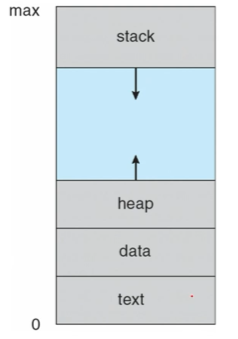
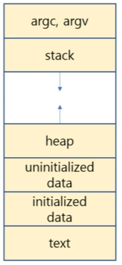
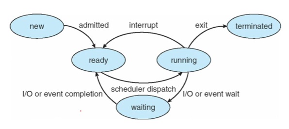
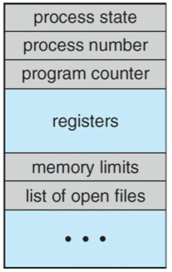
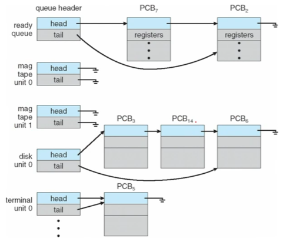
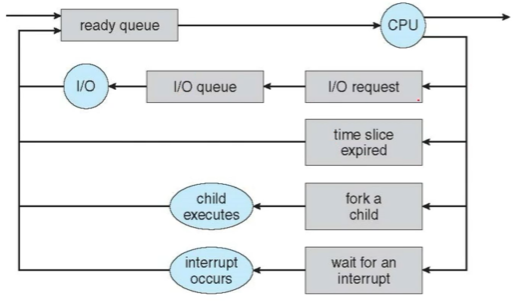
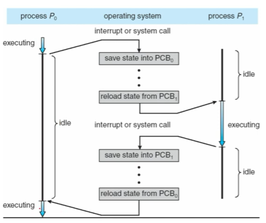
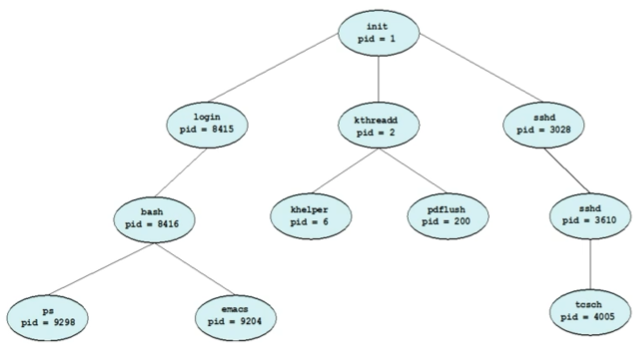
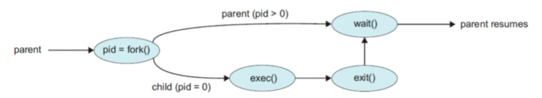

# OS02 : Processes

[인프런 **운영체제 공룡책 강의**](https://www.inflearn.com/course/%EC%9A%B4%EC%98%81%EC%B2%B4%EC%A0%9C-%EA%B3%B5%EB%A3%A1%EC%B1%85-%EC%A0%84%EA%B3%B5%EA%B0%95%EC%9D%98/dashboard) 를 듣고 정리한 내용입니다. 

## Processes 

### 3.1 Process Concept

**A _process_ is a program in execution** 

- A process is the unit of work in an operating system 
- A process will need certain resources to accomplish its task 
  - CPU time
  - memory
  - resources
    - files
    - I/O devices
- HDD 에 존재하는 프로그램을, CPU 가 fetch 가능하도록 memory 에 올려놓은 상태 (실행 중인 프로그램)

**The memory layout of a process is divided into multiple section** 

- Text section : the executable code
- Data section : global variables
- Heap section : memory that is dynamically allocated during program run time
- Stack section : temporary data storage when invoking functions, such as function parameters, return addresses and local variables 

 

```c
#include <stdio.h> 
#include <stdlib.h>

int x;
int y = 15;
int main(int argc, char *argv[])
{
    int *values;
    int i;
    
    values = (int *)malloc(sizeof(int)*5);
    
    for (i = 0; i < 5; i++)
        values[i] = i;
    
    return 0;
}
```

```shell
$ gcc 3.1 memory_layout.c
$ size ./a.out
```

=> text, data, bss, dec 등 확인 가능

**As a process executes, it changes its state**

- New : the process is being created
- Running : Instructions are being executed
- Waiting : the process is waiting for some event to occur 
  - such as an I/O completion or reception of a signal 
- Ready : the process is waiting to be assigned to a processor 
- Terminated : the process has finished execution 

 

**PCB or TCB**

- Process Control Block | Task Control Block
  - Each process is represented in the operating system by the PCB (process 관련 정보를 모두 저장하는 구조체)
- A PCB contains many pieces of information associated with a specific process
  - Process state : new, running, waiting ...
  - Program counter : memory 상의 program register 정보  
  - CPU registers : Instruction register, data register  
  - CPU-scheduling information 
  - Memory-management information 
  - Accounting information
  - I/O status information 

 

**A process is a program that performs a single thread of execution**

- The single thread of control allows the process to perform 
  - only one task at a time (process 의 instruction 이 한 줄로 쭈우욱 실행된다.)
- Modern Operating systems have extended the process concept
  - to allow a process to have multiple threads of execution 
  - and thus to perform more than one task at a time
- A _thread_ is a lightweight process 
  - Multi Processing 보다 장점이 많다. => 4장에서 다룸 

### Process Scheduling

- The Objective of multiprogramming is 
  - to have some process running at all times (concurrently, simultaneously but not parallel)
  - so as to maximize CPU utilization 
- The Objective of time sharing is 
  - to switch a CPU core among processes so frequently 
  - that users can interact with each program while it is running 
  - 실제로는 CPU 하나를 사용하고 있지만, time sharing 을 통해 사용자가 느끼기에 동시에 여러 프로그램이 돌고 있는 것처럼 느낄 수 있도록 한다. 

**Scheduling Queues**

- As processes enter the system, they are put into a _ready queue_,
  - where they are ready and waiting to execute on a CPU's core

- Processes that are waiting for a certain event to occur 
  - are placed in a wait queue
- These queues are generally implemented in the linked lists of PCBs.

 

**Queueing Diagram**

- as a common representation of process scheduling

 

**Context Switch**

- The _context_ of a process is represented in the PCB.

- When an interrupt occurs,
  - the system _saves_ the current context (program counter etc..) of the running process,
  - so that, later, it can _restore_ that context when it should be resumed

- The context switch is a task that 

  - switches the CPU core to another process.
  - performs a state save of the current process

  	- and a state restore of a different process.

 

### Operations on Processes

- An operating system must provide a mechanism for 
  - process creation,
  - and process termination.
- A process may create several new processes
  - the creating process : a parent process
  - a newly created process : a child process.

**A tree of processes**

 

- 위와 같은 트리 관계가 성립한다. 


- Two possibilities of execution

  - The parent continues to execute _concurrently_ with its children.

  - The parent _waits_ until some or all of its children have terminated. 

- The possibilities of address_space
  - The child process is a _duplicate_ of the parent process.
  - The child process has a new program loaded into it.

**Process creation using the fork() system call**

```c
#include <stdio.h>
#include <unistd.h>
#include <wait.h>

int main()
{
    pid_t pid;
    pid = fork();
    if (pid < 0) { // error occurred
        fprintf(stderr, "Fork Failed");
        return 1;
    }
    else if (pid == 0) { // child process
        execlp("/bin/ls", "ls", NULL);
    }
    else { // parent process
        wait(NULL);
        printf("Child Complete");
    }
    return 0;
}
```

 

**A process terminates**

- when it finishes executing its final statement
- `exit()` system call : asks OS to delete it.
- OS deallocates and reclaims all the resources:
  - allocated memories, open files, and I/O buffers, etc.

**Zombie and Orphan**

- _zombie_ process : a process that has terminated, 
  - but whose parent has not yet called `wait()`
  - 자식 프로세스가 먼저 종료되었지만, 부모 프로세스가 자식 프로세스의 종료 상태를 회수하지 못했을 경우.
  - 부모에서 wait 시스템콜을 사용하여, 자식 프로세스의 종료를 기다릴 수 있고, 부모가 자식의 종료 상태를 얻어 낼 수 있도록 하나의 인자를 전달 받는다. => 어떤 자식이 종료되었는지 구별할 수 있도록!
  - 프로세스의 종료 상태가 저장되어 있는 프로세스 테이블의 해당 항목은 부모 프로세스가 wait() 을 호출할 떄 까지 남아있게 된다. 
- orphan process : a process that has a parent process
  - who did not invoke `wait()` and instead terminated
  - 부모 프로세스가 자식 프로세스보다 먼저 종료되는 경우.
  - 부모 프로세스가 wait() 을 호출하는 대신에 그냥 종료를 해버린다. 
  - 자식 프로세스가 작업을 종료하면 고아 프로세스의 경우 리눅스 시스템 상의 init 프로세스가 wait 을 통해 자원을 회수하여 PID 가 1로 변한다.  (대부분의 Linux 에서 init 프로세스의 PID 는 1이기 때문)
  - init 프로세스는 주기적으로 wait() 시스템콜을 통해 고아 프로세스의 종료 상태를 수집한다. 

**In UNIX-like O/S**

- A new process is created by the `fork()` system call
- The child process consists of 
  - a _copy of the address space_ of the parent process. 
  - 부모의 메모리 주소 공간을 그대로 복사함 
- Both processes continue execution 
  - at the instruction after the `fork()` system call 
- With one difference :
  - the return code for the `fork()` is _zero_ for the child process, whereas 
  - the _nonzero_ pid of the child is returned to the parent process
  - nonzero pid => OS 가 부여한 pid

```c
#include <stdio.h>
#include <unistd.h>

int main() 
{
    pid_t pid; // process id 
    pid = fork(); // child process 생성 
    printf("Hello, Process! %d\n", pid); // parent 에서 실행. 그 후 parent 종료.
}
```

- parent 종료 후, ready queue 에 대기하던 child (그대로 복사된) 가 CPU 에 restore 되어 실행.
- 따라서 printf 문이 두 번 실행된다.  
  - 그러나, child process 는 pid 를 0 을 받는다. 

**After a `fork()` system call**

- the parent can continue its execution; or 
- if it has nothing else to do while the child runs, 
  - it can issue a `wait()` system call 
  - to move itself off the ready queue until the termination of the child 

```C
#include <stdio.h>
#include <unistd.h>
#include <wait.h>

int main() 
{
    pid_t pid; 
    pid = fork();
    if (pid > 0) // parent 에서만 wait 을 호출한다. 
        wait(NULL);
    printf("Hello, Process! %d\n", pid);
}
```

- parent 가 wait 을 호출하면, 점유하고 있던 CPU 를 반납하고 wait queue 에 가서 기다림.
  - 그 이후 ready queue 에 있던 child 가 CPU 를 점유함. 
  - child 가 printf 를 하고, wait queue 에 있던 parent 에 interrupt 를 걸면, parent 가 다시 CPU 를 점유함.

**Exercise 3.1 (p.154)**

```c
int value = 5;
int main() 
{
    pid_t pid;
    pid = fork();
    
    if (pid == 0) { // child process
        value += 15;
        return 0;
    }
    else if (pid > 0) { // parent process
        wait(NULL);
        printf("Parent: value = %d\n", value); // LINE A
    }
}
```

- What output will be at Line A?
  - fork 하는 시점에 value 가 5
  - parent 에서 wait 
  - child 가 실행될 때, child 의 value 가 20 이 됨 => parent 에는 영향을 미치지 않는다. 
- address space 를 복사할 때, value 를 새로 복사해서 가져간다. 

**Exercise 3.2 (p.154)**

```c
// Q. How many processes are created?
int main() 
{
	fork(); // a. fork a child process
    fork(); // b. fork another child process
    fork(); // c. and fork another 
    
    return 0;
}
```

- P~0~

  - a. P~1~ 
    - b. P~3~
      - c. P~7~
    - c. P~5~ 

  - b. P~2~
    - c. P~6~
  - c. P~4~

- 총 8 개가 생성된다. 

**Exercise 3.11 (p.905)**

```c
// Q. How many processes are created?
int main() 
{
	int i;
    
    for (i = 0; i < 4; i++)
        fork();
    
    return 0;
}
```

- fork() 가 4번 반복되는 것과 같다 ( exercise 3.2 와 동일)
- 2^4^ = 16 

```C
int value = 5
int main() 
{
    fork();
    value += 5;
    printf("Hello, fork()! %d\n", value);
    fork();
    value += 5;
    printf("Hello, fork()! %d\n", value);
    fork();
    value += 5;
    printf("Hello, fork()! %d\n", value);

    return 0;
}
```

**Exercise 3.12 (p.905)**

```c
// Q. when will LINE J be reached?
int main()
{
    pid_t pid;
    pid = fork();
    
    if (pid == 0) {
        execlp("/bin/ls", "ls", NULL);
        printf("LINE J\n");
    }
    else if (pid > 0) {
        wait(NULL);
        printf("Child Complete\n");
    }
    
    return 0;
}
```

- `execlp()`
  - 같은 일을 반복하려고 process 를 생성하는 일은 드물다 (multi thread 를 쓰는 경우가 많음)
  - 만약 전혀 다른 일을 하고 싶을 때, 
    - `fork()` 는 parent 와 동일한 child 를 생성하므로 안됨.
    - `execlp()` 를 통해 복사된 address space 를 parent 와는 다른 "ls" 로 덮어씌운다. 
- ls 가 출력된 이후에, Chlid Complete 만 출력되고, LINE J 가 출력되지 않는다.  
  - child address 를 ls 로 덮어씌웠기 때문에, printf 문이 제거된다. 

**Exercise 3.13 (p.905)**

```c
// Q. what are the pid values?
int main() 
{
    pid _t pid, pid1;
    pid = fork(); // child pid 를 return 한다. 
    if (pid == 0) { // child process
        pid1 = getpid(); 
        printf("child: pid = %d\n", pid); // A
        printf("child: pid1 = %d\n", pid1); // B
    }
    else if (pid > 0) {
        pid1 = getpid();
        printf("parent: pid = %d\n", pid); // C
        printf("parent: pid1 = %d\n", pid1); // D
        wait(NULL);
    }
    return 0;
}
```

- `getpid()` 를 통해 프로세스 자기 자신의 pid 를 가져올 수 있다. 
  - C : child pid 
  - D : parent pid 
  - A : zero 
  - B : child pid 

**Exercise 3.16 (p.905)**

```c
#define SIZE 5
int nums[SIZE] = {0, 1, 2, 3, 4};

int main()
{
	pid_t pid;
    int i;
    pid = fork();
    
    if (pid == 0) { // child process
        for (i = 0; i < SIZE; i++) {
            nums[i] *= i;
            printf("CHILD: %d \n", nums[i]); // LINE X
        }
    }
    else if (pid > 0) { // parent process
        wait(NULL);
        for (i = 0; i < SIZE; i++) {
            printf("PARENT: %d \n", nums[i]); // LINE Y
        }
    }
}
```

- 배열일 때도 마찬가지로, address space 에 새롭게 복사되므로, child 의 변화가 parent 에 영향을 주지 못한다. 
