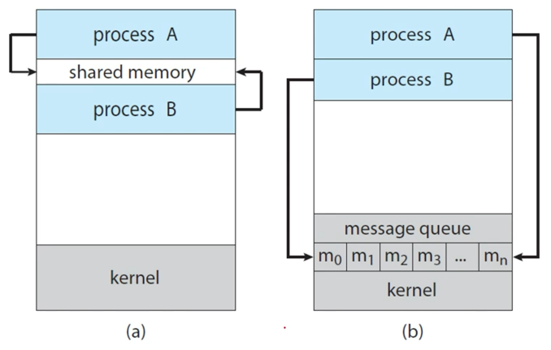
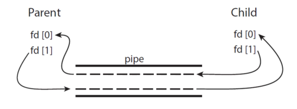
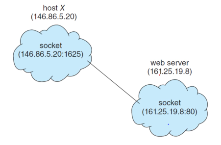

# OS03 : Process => IPC

[인프런 **운영체제 공룡책 강의**](https://www.inflearn.com/course/%EC%9A%B4%EC%98%81%EC%B2%B4%EC%A0%9C-%EA%B3%B5%EB%A3%A1%EC%B1%85-%EC%A0%84%EA%B3%B5%EA%B0%95%EC%9D%98/dashboard) 를 듣고 정리한 내용입니다. 

## IPC 

### 3.4 Inter-Process Communication 

**Processes executing concurrently may be**

- either _independent_ processes or _cooperating_ processes
- A process is independent 
  - if it does not share data with any other processes
- A process is cooperating
  - it it can affect or be affected by the other processes.
  - Clearly, any processes that shares data with other processes is a cooperating process

**IPC (Inter-Process Communication)**

- Cooperating processes require an IPC mechanism 
  - that will allow them to exchange data
  - that is, _send data to_ and _receive data from_ each other 

**Two fundamental models of IPC**

- shared memory : (a)
- message passing : (b)



### 3.5 IPC in Shared-Memory Systems

**Consider the Producer-Consumer problem**

- to illustrate the concept of cooperating processes.
- a common paradigm for cooperating processes

**Producer-Consumer Problem :**

- A _producer_ produces information that is consumed by a _consumer_
- For example,
  - a _compiler_ produces assembly code, and a _assembler_ consumes it
  - a web server produces an HTML file, and a browser consume it 

**A solution using shared-memory**

- To allow producer and consumer to run _concurrently_.

  => producer 와 consumer 가 CPU 를 사이좋게 time sharing 

- Let a _buffer_ of items be available,

  - a producer can _fill the buffer_, and
  - a consumer can _empty the buffer_.

  => buffer (대부분 bounded buffer) 가 가득차면 producer 는 buffer 가 empty 될 때까지 wait..

  따라서 buffer 를 shared memory 로 이용하자 

- A _shared memory_ is a region of memory 

  - that is shared by the producer and consumer processes.

  => process 공유의 메모리 공간은 침범하지 않고, 공유된 메모리 영역을 사용하자

**Define a shared buffer**

- in a region of memory shared by the producer and consumer process
- 아래 처럼 전역 변수 설정으로 하면 안되지만, 일단 독립된 공간에 공유된 buffer 가 있다고 가정하자! 

```c
# define BUFFER_SIZE 10 

typedef struct {
    //...
} item

item buffer[BUFFER_SIZE];
int in = 0;
int out = 0;
```

```c
// producer
item next_produced;

while (true) {
    // produce an item in next_produced // next_produced = (item*)malloc(SIZE)
    while (((int + 1) & BUFFER_SIZE) == out) // 더 이상 공간이 없을 경우 대기한다. 
        ; // do noting
    buffer[in] = next_produced; // buffer 의 in 위치에 next_produced 저장
    in = (in + 1) & BUFFER_SIZE
}
```

```c
// consumer
while (true) {
    while (in == out) 
        ; // do nothing
    next_consumed = buffer[out];
    out = (out + 1) & BUFFERED_SIZE;
    // consume the item in next_consumed
}
```

- producer 와 consumer code 가 concurrent 하게 동작하도록 한다. 

  context switch between producer and consumer 

### 3.6 IPC in Message-Passing Systems

**The scheme of using shared-memory**

- requires that processes share a region of memory and that

- the code for accessing and manipulating the shared memory

  - be written _explicitly_ by the application programmer 

  producer consumer N:N 관계에서, shared memory 접근을 위한 코드를 앱 개발자가 짜야한다. 

  => 앱 개발자 입장에서 매우 어려움 (불편함)

**Message-Passing**

- O/S provides the means for cooperating processes

  - to communicate with each other via a _message-passing_ facility

  => OS 가 message 전달 API 를 제공 

**Two operations of the message-passing facility**

- send(message)
- receive(message)

```c
// producer
message next_produced;
while (true) {
    // produce an item in next_produced
    send(next_produced);
}
```

```c
// consumer
message next_consumed;

while (true) {
    receive(next_consumed);
    // consume the item in next_consumed 
}
```

- 복잡한 과정은 OS 에게 맡기고 감춘다. 

**Communication Links**

- if two processes P and Q want to communicate,
  - the must send to and receive messages from each other
- This comm. link can be implemented in a variety of ways
  - _direct_ or _indirect_ communication
  - _synchronous_ and _asynchronous_ communication
  - automatic or explicit buffering

**Under direct communication**

- each process that wants to communicate

  - must explicitly _name_ the _recipient_ or _sender_ of the communication 

  direct 하므로, 누구에게 message 를 주는지 명시해야함.

- The primitives of this scheme:
  - `send(P, message)` - send a message to Process P.
  - `receive(Q, message) ` - receive a message from Process Q.

- the properties of communication links in this scheme:

  - Links are established _automatically_
  - A link is associated with _exactly two processes_.
  - There exists _exactly one link_ between each pair of processes.

  오직 두 개 프로세스 사이에 direct 하게 연결되므로, link 가 자동으로 생성되며 오직 하나만 존재한다. 

**With indirect communication**

- the messages are sent to and received from _mailboxes_, or _ports_
- A mailbox (also referred to as **ports**)
  - can be views abstractly as an object
  - *into* which messages can be *placed* by processes, and 
  - *from* which messages can be *removed*

- The primitives of this scheme:

  - `send(A, message)` - send a message to mailbox A.
  - `receive(A, message)` - receive a message from mailbox A

- The properties of communication links in this scheme:

  - Links are established between a pair of processes
    - only if _both members_ of the pair have a _shared mailbox_
  - A link may be associated with *more than two processes*
  - A number of *different links may exist*, between each pair of processes
    - with each link corresponding to one mailbox

  indirect 한 연결의 경우, 프로세스가 모두 같은 mailbox 를 공유하는 경우에 link 가 생성되며, 1:1 이 아니라 복잡한 관계도 성립이 가능하다. 

**OS provides a mechanism that allows a process to do :**

- Create a new mailbox
- Send and Receive messages through the mailbox 
- Delete a mailbox 

**Different design options from implementation :**

- *blocking* and *non-blocking* : *synchronous* or *asynchronous*

**blocking** : mail box 의 용량이 정해져있고, 그 용량을 초과하는 message 를 전송하고자 할 때, producer 는 consumer 가 mailbox 를 비울 동안 대기해야 한다. 

**non-blocking** : 그러나 만약 producer 가 OS 측에 모든 message 를 전송하고 다른 일을 수행할 수 있으면 훨씬 효율적일 것이다

- Blocking send : the sender is blocked until the message is received.

- Non-blocking send : the sender sends the message and continue.

- Blocking receive : the receiver blocks until a message is available.
- Non-blocking receive : the receiver retrieves either a valid message or a null message.

**synchronous** : blocking 상황에서는, sender, receiver 가 데이터를 전송하고 받는 것을 완료할 때까지 다른 역할을 수행할 수 없다.

**asynchronous** : non-blocking 상황에서는, 상대방에게 전송이 완료되었는지 확신할 수 없다. 


### 3. 7 Examples of IPC Systems 

**Examples of IPC Systems**

- Shared Memory : *POSIX Shared Memory*
  - POSIX : Portable Operating System Interface (for uniX)

- Message Passing : Pipes
  - One of the earliest IPC mechanisms on UNIX systems.

**POSIX shared memory**

- is organized using memory-mapped files, 
  - which associate the region of shared memory with a file 
  - (하드디스크 공간이 아닌) memory-mapped 영역을 사용하여 shared memory 영역을 잡는다. 
- First, create a shared-memory object:
  - `fd = shm_open(name, O_CREAT | ORDWR, 0666);`
- Configure the size of the object in bytes:
  - `ftruncate(fd, 4096);`
- Finally, establish a memory-mapped file:
  - `mmap(0, SIZE, PROT_READ | PROT_WRITE, MAP_SHARED, fd, 0);`


**producer process illustrating POSIX shared-memory API**

```C
#include <stdio.h>
#include <stdlib.h>
#include <string.h>
#include <fcntl.h>
#include <sys/shm.h>
#include <sys/stat.h>
#include <sts/mman.h>

int main()
{
    const int SIZE = 4096; // the size of the memory
    const char *name = "OS"; // the name of the memory
    const char *message_0 = "Hello, ";
    const char *message_1 = "Shared Memory!\n";
    
    int shm_fd; // the file descriptor of shared memory  
    char *ptr // pointer to shared memory
        
    shm_fd = shm_open(name, O_CREAT | O_RDWR, 0666);
    
    ftruncate(shm_fd, SIZE);
    
    ptr = (char *)mmap(0, SIZE, PROT_READ | PROT_WRITE, MAP_SHARED, shm_fd, 0);
    
    // write to the shared memory 
    sprintf(ptr, "%s", message_0); // ptr 위치에 message_0 을 쓰고 
    ptr += strlen(message_0); // 포인터 옮기고 
    sprintf(ptr, "%s", message_1); //  쓰고 
    ptr += strlen(message_1); // 옮기고 
    
    return 0;
}
```

**consumer**

```c
#include <stdio.h>
#include <stdlib.h>
#include <fcntl.h>
#include <sys/shm.h>
#include <sys/stat.h>
#include <sts/mman.h>

int main()
{
    const int SIZE = 4096; // the size of the memory
    const char *name = "OS"; // the name of the memory
    
    int shm_fd; // the file descriptor of shared memory  
    char *ptr // pointer to shared memory
    
    shm_fd = shm_open(name, O_RDONLY, 0666);

    ptr = (char *)mmap(0, SIZE, PROT_READ, MAP_SHARED, shm_fd, 0);
    
    // read from the shared memory object 
    printf("%s", (char *)ptr); 
    
    // remove the shared memory 
	shm_unline(name);
    
    return 0;
}
```

****

**Pipes were**

	- one of the first IPC mechanisms in early UNIX systems.
	- A pipe acts as a conduit allowing two processes to communicate

**Four issues of pipe implementation**

- Does the pipe allow *unidirectional* or *bidirectional* communication?
- In the case of two-way comm., is it *half-duplex* or *full-duplex*?

- Must a *relationship* exist between the communicating process?
  - such as parent-child
- Can the pipes communicate *over a network*?
  - network 에서 사용 가능한 pipe 를 socket 이라고 부른다.. 

**Two common types of pipes**

- Ordinary pipes :
  - cannot be accessed from outside the process that created it.
  - Typically, a parent process creates a pipe and uses it to communicate with a child process that it created.
- Named pipes :
  - can be accessed *without* a parent-child relationship.

**Ordinary pipes**

- allow two processes to communicate in producer-consumer fashion.

  - the producer writes to one end of the pipe(write end)
  - the consumer reads from the other end (read end)

- unidirectional : only one-way communication is possible

- two-way communication? => use two pipes!

  

**On UNIX systems**

- ordinary pipes are constructed using the function :
  - `pipe(int fd[])`
  - `fd[0]` : the read end of the pipe
  - `fd[1]` : the write end 

```c
#include <stdio.h>
#include <string.h>
#include <unistd.h>
#include <sys/types.h>

#define BUFFER_SIZE 25
#define READ_END 0
#define WRITE_END 1

int main() 
{
	char write_msg[BUFFER_SIZE] = "Greetings";
    char read_msg[BUFFER_SIZE]
    int fd[2]; // file descriptor
    pid_t pid;
    
    pipe(fd); // create the pipe
    
    pid = fork(); // for a new process
    	
    if (pid > 0) { // parent process (producer)
        close(fd[READ_END]);
        // write to the pipe
        write(fd[WRITE_END], write_msg, strlen(write_msg) + 1);
        close(fd[WRITE_END])
    } 
    else if (pid == 0) { // child process (consumer)
        close(fd[WRITE_END]);
        // read to the pipe
        read(fd[READ_END], read_msg, BUFFER_SIZE);
        printf("read %s\n", read_msg);
        close(fd[READ_END]);
    }
}
```

- wait 이 없으므로, parent child 가 concurrent 하게 실행 
- `pipe(fd)` 를 통해서, `fd[1]`, `fd[0]` 두 개의 파이프가 생성되고, parent 가 `fd[1]` 에 write 하면 child 가 read 할 수 있다. 

****

### Communication in Client-Server Systems

**Two other strategies in client-server systems**

- network 로 연결된 두 개의 PC, 두 개의 process 는?
  - shared memory 사용 가능한가?
  - pipe 사용 가능한가?
- Sockets
  - are defined as endpoints for communication.
  - IP address 와 port 를 통해 process 에 binding 된 파이프!! 
- RPCs (Remote Procedure Calls)
  - abstracts procedure calls between processes on networked systems.
  - 원격에 존재하는 procedure(예를 들면 함수) 를 호출한다. 

**A socket is**

- identified by an **IP address** concatenated with a **port** number.

 

**Java provides**

- a much easier interface to sockets and 
- provides three different types of sockets
  - Socket class : connection-oriented (TCP) => 많이 사용함
  - DatagramSocket class : connectionless (UDP) (broadcast)
  - MulticastSocket class : multiple recipients

```java
import java.net.*;
import java.io.*;

public class DataServer {
    public static void main(String[] args) throws Exception {
        ServerSocket server = new ServerSocket(6013); // port 6013
        
        // now listen for connections
        while (true) {
            System.out.println("Listening...")
            Socket client = server.accept();
            PrintWriter pout = new PrintWriter(client.getOutputStream(), true);
            System.out.println("New Client is connected...")
            // write the date to the socket
            pout.println(new java.util.Date().toString());
            
            // close the socket and resume listening for connections
            client.close(); // 요청 받은 client close 
        }
    }
}
```

```java
import java.net.*;
import java.io.*;

public class DataClient {
    public static void main(String[] args) throws Exception {
        // make connection to server socket 
        Socket socket = new Socket("127.0.0.1", 6013); // port 6013
        
        InputStream in = socket.getInputSteam();
        BufferedReader br = new BufferedReader(new InputStreamReader(in));
        
        // read date from the socket 
        String line = null;
        while ((line = br.readLine()) != null))
            System.out.println(line);
        
        // close the socket connection 
        socket.close();
    }
}
```

**RPC (Remote Procedure Call)**

- one of the most common forms of remote service.
- designed as a way to abstract  the procedure-call mechanisms
  - for use between systems with network connections
  - 원격에 있는 함수(procedure) 를 호출하자!

- A client invokes a procedure on a remote host
  - as it would invoke a procedure locally 

**The RPC system **

- hides the details that allow communication to take place
  -  by providing a **stub** on the client side
- The stub of client-side locates the server and 
  - **marshals** the parameters 
  - marshaling => 객체 직렬화와 비슷하다. 
- The stub of server-side received this message,
  - unpacks the marshalled parameters, and 
  - performs the procedure on the server 

### 정리

IPC vs RPC 
