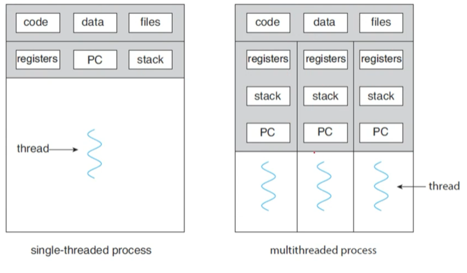
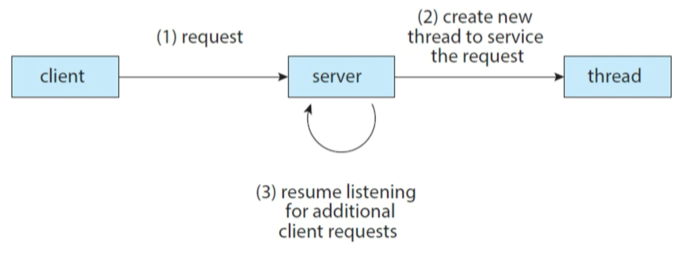
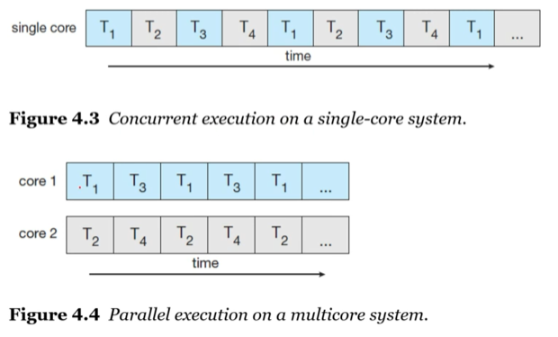
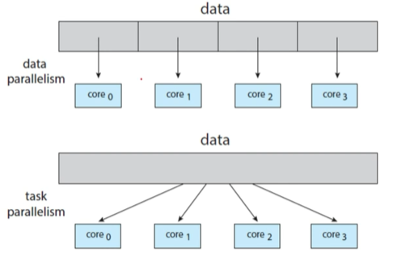
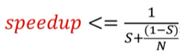
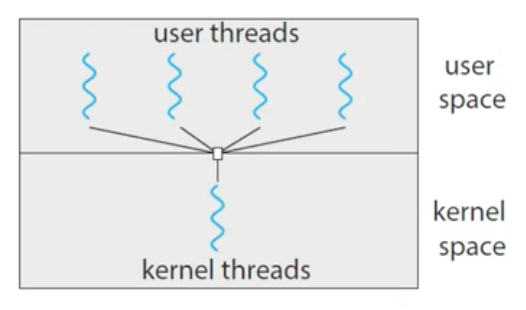
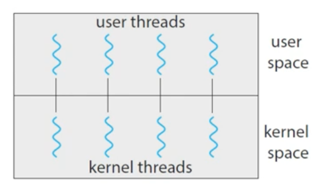
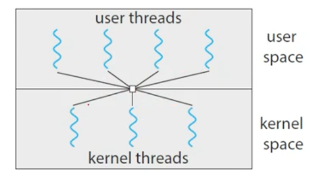
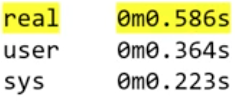
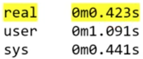

# OS04 : Threads

[인프런 **운영체제 공룡책 강의**](https://www.inflearn.com/course/%EC%9A%B4%EC%98%81%EC%B2%B4%EC%A0%9C-%EA%B3%B5%EB%A3%A1%EC%B1%85-%EC%A0%84%EA%B3%B5%EA%B0%95%EC%9D%98/dashboard) 를 듣고 정리한 내용입니다. 

## Threads

### 4.1 Overview

**So far, we assumed that**

- 지금까지!
  - CPU => fetch process on memory & execute 
  - if not one, CPU time share & context switch => concurrent multi-programming

- a process was an executing program with *a single thread of control*.
- however, a process is able to contain *multiple threads of control*
- isn't it?

**A thread is**

- a lightweight process.
- a basic unit of CPU utilization.
- comprises a *thread ID*, a *program counter*, a *register set*, and a *stack*.
- 무슨 말인가!
  - 프로세스가 여러 개 동작하는 것은, CPU 의 program counter 가 instruction 정보를 가져와서 context switch 하기 때문!
  - 그러나, program counter, 즉 register set 정보만 별도로 유지한다면 같은 프로그램 안에서도, (굳이`fork()`하여 복제할 필요 없이), thread 만 관리가 가능하다. 
  - 즉, CPU 를 점유하는 단위 (basic unit) 이 thread 가 된다. 
  - pid 대신에 tid (Thread ID) 가 CPU 를 점유한다. 
- 아래 그림처럼, thread 는 code 와 data 영역은 공유하고, 독립적인 register 와 program counter 를 갖는다.




**Motivation for multiThreading**

- Let us consider the case of client-server system, (Multithread server architecture )
  - 지난 시간에 배운 socket 을 통한 데이터 전송에서, server 에 새로운 연결이 들어오면 기존에 있던 데이터 전송을 모두 처리한 뒤에, 다시 새로운 연결을 accept 해야 함. 
  - 만약 요청이 들어올 때 server 가 새로운 thread 를 생성하여 처리를 맡기고, server는 또 다시 non-blocking 으로 resume 을 하게 되면, thread 생산 한도까지 요청을 받는 것이 가능하다. 



**The benefits of multithreaded programming :**

- Responsiveness : may allow continued execution 
  - if part of process is blocked, especially important for user interfaces.
- Resource Sharing : threads share resources of process (code, data 영역을 공유한다.)
  - easier than IPC (shared-memory or message-passing)
- Economy : cheaper than process creation,
  - thread switching lower overhead than context switching. (PCB switching vs thread switching)

- Scalability : process can take advantage of multiprocessor architectures. (multicore 에서 병렬처리 가능)

### 4.4 Thread Library 

**Threads in Java**

- in a Java program,
  - threads are the fundamental model of program execution (thread 기반)
- Java provides a rich set of features
  - for the creation and management of threads

**Three techniques for explicitly creating threads in Java**

- Inheritance from the `Thread` class (다중 상속 불가)
  - create a new class that is derived from the `Thread` class.
  - and override its `public void run()` method.
- Implementing the `Runnable` interface
  - define a new class that implements the `Runnable` interface
  - and override its `public void run()` method
- Using the `Lambda` expression (beginning with Java Version 1.8) 
  - rather than defining a new class, (thread 생성은 간단하므로 굳이 class 만들 필요 없다. )
  - use `lambda expression` of `Runnable` instead

**1.  Thread class 상속받기**

```java
class MyThread1 extends Thread {
    public void run() {
        try {
            while (true) {
                System.out.println("Hello, Thread!");
                Thread.sleep(500); // 500ms, 0.5s interval 
            }
        }
        catch (InterruptedException ie) {
            System.out.println("I'm iterrupted");
        }
    }
}
```

```java
public class ThreadExample1 {
    
    public static final void main(String[] args) {
        MyThread1 thread = new MyThread1(); // 인스턴스 생성
        thread.start(); // .run() 을 direct call 하지 않고 start 호출 
        System.out.println("Hello, My Child!");
    }
}
```

- `Hello, My Child!` 가 먼저 출력되고, `Hello, Thread!` 가 출력

  - `fork()` 와 비슷하다고 보면 된다. 
  - main method 에서 실행되고 있는 main thread 가 새로운 thread 를 생성하고, 

  - start 를 호출하면 `run()` 이 실행된다. 
  - start 호출 이후에, thread switch 가 일어나지 않았으므로 그대로 `Hello, My Child!` 가 먼저 호출된다. 

**2. Runnable Interface 구현하기**

```java
class MyThread2 implements Runnable {
    public void run() {
        try {
            while (true) {
                System.out.println("Hello, Runnable!");
                Thread.sleep(500);
            }
        }
        catch (InterruptedException ie) {
            System.out.println("I'm iterrupted");
        }
    }
}
```

```java
public class ThreadExample2 {
    
    public static final void main(String[] args) {
        Thread thread = new Thread(new MyThread2()); 
        // MyThread2 객체를 생성하여 Thread class 생성자에 파라미터로 넘겨준다. 
        // 이 경우 thread 의 run 을 호출할 때, MyThread2 의 run 을 호출하게 된다!!!
        thread.start(); 
        System.out.println("Hello, My Runnable Child!");
    }
}
```

**3. Runnable lambda expression 사용하기**

```java
public class ThreadExample3 {
    
    public static final void main(String[] args) {
        Runnable task = () -> {
            try {
                while (true) {
                    System.out.println("Hello, Lambda Runnable!");
                    Thread.sleep(500);
                }
            }
            catch (InterruptedException ie) {
                System.out.println("I'm iterrupted");
            }
        };
        Thread thread = new Thread(task); 
        thread.start(); 
        System.out.println("Hello, My Runnable Child!");
    }
}
```

****

**부모 쓰레드의 대기 : wait? join!**

```java
public class ThreadExample4 {
    
    public static final void main(String[] args) {
        Runnable task = () -> {
            for (int i = 0; i < 5; i ++) { // 5번만 
                System.out.println("Hello, Lambda Runnable");
            }
        };
        Thread thread = new Thread(task); 
        thread.start(); // 여기까지 동일 
        try {
            thread.join(); // parent 가 wait 하면서, child 의 종료를 기다림.
        }
        catch (InterruptedException ie) {
            System.out.println("Parent thread is interrupted");
        }
        System.out.println("Hello, My Joined Child!");
    }
}
```

- child 의 print 문이 먼저 출력된다. 

**쓰레드의 종료 : stop? interrupt!**

- `thread.stop()` is deprecated
- thread 도 process 의 `new`, `ready`, `running`, `wait` 과 같은 process state 를 그대로 가지고 있다. 

```java
public class ThreadExample4 {
    
    public static final void main(String[] args) {
        Runnable task = () -> {
            try {
                while (true) {
                    System.out.println("Hello, Lambda Runnable!");
                    Thread.sleep(100);                
            }
            catch (InterruptedException ie) {
                System.out.println("I'm iterrupted");
            }
        };
        Thread thread = new Thread(task); 
        thread.start(); // 여기까지 동일 
		Thread.sleep(500);
        thread.interrupt();
        System.out.println("Hello, My Interrupted Child!");
    }
}
```

- main thread sleep 500ms, then interrupt 
- child 가 다섯번 정도 출력하는 중에, interrupt 에 의해 catch 문을 실행하고, exit 될 것 

### 4.2 Multicore Programming

**Multithreading in a Multicore system**

- more efficient use of multiple cores for improved concurrency.
- 멀티 코어의 경우, core 하나를 time sharing 할 필요 없이, thread 각각이 코어 각각을 점유하면 된다!
- consider an application with four threads
  - single-core : threads will be *interleaved* over time (interleaved => 사이사이에 끼워넣는 것)
  - multiple-cores : some threads can run in parallel.

 

**Programming Challenges in Multicore systems.**

- *Identifying Tasks* : find areas can be divided into separate tasks (task 를 분할할 수 있는 영역을 찾는다)
- *Balance* : ensure the tasks to perform equal work of equal value.
- *Data Splitting* : data also must be divided to run on separate cores.
- *Data dependency* : ensure that the execution of tasks is synchronized to accommodate the data dependency (ex. merge sort 와 같은 경우 dependency 가 생긴다. )
- *Testing and debugging* : more difficult than single-thread. 

**Types of parallelism :** 

- data parallelism 
- task parallelism
- 현재는 구분할 필요가 없다 => distribution (Hadoop) 분산 시스템

 

**Amdahl's Law :**

- 코어는 무조건 많을 수록 좋은가?


- S : the portion that must be performed serially on a system (serial 하게 실행되어야 하는 부분)
- N : the number of processing cores 
- ex)
  - S = 0.25, N = 2, speedup = 1.6
  - S = 0.25, N = 4, speedup = 2.28
- speedup 은 S 가 50% 만 되어도, 코어가 아무리 많아도 속도 향상이 2배 이상 넘기 힘들다. 

****

### 4.3 Multithreading Models 

**Two types of threads**

- 'user' threads & 'kernel' threads
    - ex) Java 를 통해 생성한 thread 는, OS core 를 관리할 수 없다 => user threads (green threads), 
    - now => native threads == kernel threads

- User threads are
    - supported above the kernel, and 
    - are managed without kernel support.
    - user space 위에서!
- Kernal threads are 
    - supported and managed directly by the operating system.
    - kernal space 위에서!

**Three relationships between user and kernel threads**

- Many-to-One Model 
- One-to-One Model 
- Many-to-Many Model 

 

### 4.4 Thread Libraries

**A thread library provides**

- an API for creating and managing threads.

- Three main thread libraries are in use today:
    - POSIX Pthreads
    - Windows thread
    - Java thread : JVM running => independent to OS

**Pthreads**

- refers to the POSIX standard (1EEE 1003.1c)
- just a specification for thread behavior, not an implementation.

```c
#include <stdio.h>
#include <stdlib.h>
#include <pthread.h>
 
// the data shared by the threads
int sum;
// thread call this function 
void * runner(void *param); // like java 'public void run'

int main(int argc, char *argv[]) // 
{
		pthread_t tid;
  	pthread_attr_t attr;

  	pthread_attr_init(&attr);
  	// new thread 
  	pthread_create(&tid, &attr, runner, argv[1]);  
  	pthread_join(tid, NULL);
  
  	printf("sum = %d\n", sum);
}
void *runner(void *param)
{
    int i, upper = atoi(param); //array to integer 
    sum = 0;
    for (i = 1, i <= upper, i++)
        sum += 1;
    pthread_exit(0);
}
```

`$gcc -pthread pthread.c`

****

**Exercise 4.17 (p.910)**

- consider the following code segment:

  ```c
  pid_t pid;
  
  printf("A = %d\n", getpid());
  pid = fork(); // 1. p1 created from p0
  if (pid == 0) { // child process
      fork(); // 2. p3 created from p1 
      thread_create(...); 
    	// 4. thread created from p1, p3
  }
  fork(); 
  // 3. p2 created from p0
  // p4 created by p1
  // p5 created by p3
  ```

- How many unique processes are created? 6

- How many unique threads are created? 8 (single thread process 6 포함)

- test code example

  ```c
  pid_t pid;
  
  printf("A = %d\n", getpid());
  pid = fork(); // 1. p1 created from p0
  if (pid > 0) {
      wait(NULL);
      printf("B = %d\n", pid());
  }
  if (pid == 0) { // child process
      fork(); // 2. p3 created from p1 
      if (pid > 0) {
          wait(NULL);
          printf("C = %d\n", pid());
      }
      thread_create(...); 
      // 4. thread created from p1, p3
  }
  fork(); 
  if (pid > 0) {
      wait(NULL);
      printf("D = %d\n", pid);
  }
  ```
  
  ```pseudocode
  // output
  A = 18937
  I'm a thread!
  D = ...
  C = ...
  I'm a thread!
  D = ...
  B = ...
  D = ...
  ```

- A = 1
  - `fork()` B = 2
    - `fork()` C = 3
      - C create thread
    - B create thread
  - A, B, C `fork()` 
    - D = 4
    - D = 5
    - D = 6

**Exercise 4.19 (p.910)**

```c
#include <stdio.h>
#include <unistd.h>
#include <wait.h>
#include <pthread.h>

int value = 0;
void *runner(void *param);

int main(int argc, char *argv[])
{
    pid_t pid;
    pthread_t tid;
    pthread_attr_t attr;
		
    pid = fork();
    if (pid == 0) {
        pthread_attr_init(&attr);
        pthread_creat(&tid, &attr, runner, NULL);
        pthread_join(tid, NULL);
        printf("CHILD: value = %d\n", value); // LINE C
    }
    else if (pid > 0) {
        wait(NULL);
        printf("PARENT: value = %d\n", value); // LINE P
    }
}
void *runner(void *param)
{
    value = 5;
    pthread_exit(0);
}
```

- `fork()` 를 통해 생성된 process 는 서로 다른 value 를 갖는데, 
  - process 내에서 thread 는 같은 value 를 공유한다. 

- child process
  - 생성한 thread 에서, value 를 5로 변경하는데, main thread 의 print 문에서, value 는 변경된 5 라는 값을 출력한다. 
- parent process
  - parent 에서는 thread 를 생성하지 않고, child 의 value 와 다른 data space 를 사용하므로, 변경되지 않은 0 이라는 값을 출력한다. 

****

### 4.5 Implicit Threading

**The Strategy of Implicit Threading**

- ex) Java Executor framework => thread 복잡한 것들 추상화 
- The design of concurrent and parallel applications
  - i.e., the design of miltithreading in multicore systems
  - is too difficult for application developers
- So, transfer the difficulty to compiler and run-time libraries
  - java.concurrent

**Four alternative approaches using implicit threading :**

- Thread Pools 
  - create a number of threads in a pool where they await work.
  - thread 생성을 개발자가 하지 않도록, 미리 생성해 둔 pool 내에서 가져다가 씀. 
- Fork & Join 
  - explicit threading, but an excellent candidate for impliit threading.
- OpenMP 
  - a set of compiler directives and an API for programs written in C/C++.
- Grand Central Dispatch (GCD)
  - developed by Apple for its macOS and iOS operating system.

**OpenMP**

- identifies parallel regions as blocks of code that may run in parallel.
- insert compiler directives into source code at parallel regions.
  - 컴파일러에게 parallel 동작이 필요한 부분을 알려줘서 지시함. 
- these directives instruct OpenMP runtime library to execute the region in parallel 

```c
#include <stdio.h>
#include <omp.h>

int main(int argc, char *argv[])
{
  	#pragma omp parallel // compiler directive
    {
				printf("I am a parallel region.\n");
    }
  	return 0;
}
// output => 병렬처리 되어 print 문 여러 번 실행
```

`$gcc -fopenmp OpenMP1.c`

- set thread number

```c
#include <stdio.h>
#include <omp.h>

int main(int argc, char *argv[])
{
  	omp_set_num_thread(4);
  
  	#pragma omp parallel // compiler directive
    {
				printf("OpenMP thead: %d\n", omp_get_thread_num());
    }
  	return 0;
}
```

- #pragma omp parallel for 

  - for 문 병렬처리!

  - 시간 비교 

    - time ./sum_not_parallel

     

    - time ./sum_parallel 

     

```c
#include <stdio.h>
#include <omp.h>

#define SIZE 100000000

int a[SIZE], b[SIZE], c[SIZE]
  
int main(int argc, char *argv[])
{
  	int i;
  	for (i = 0; i < SIZE; i++) {
      	a[i] = b[i] = i; // 1, 2, 3, 4 ...
    }
      	
  	#pragma omp parallel for // compiler directive
    for (i = 0; i < SIZE; i++) {
      	c[i] = a[i] + b[i];
    }
      	
  	return 0;
}
```

