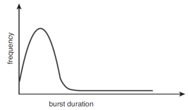

# OS05 : CPU scheduling

[인프런 **운영체제 공룡책 강의**](https://www.inflearn.com/course/%EC%9A%B4%EC%98%81%EC%B2%B4%EC%A0%9C-%EA%B3%B5%EB%A3%A1%EC%B1%85-%EC%A0%84%EA%B3%B5%EA%B0%95%EC%9D%98/dashboard) 를 듣고 정리한 내용입니다. 

## CPU scheduling

### 5.1 Basic Concepts

**CPU scheduling is**

- the basis of multiprogrammed operating systems
- The objective of multiprogramming is 
  - to have some processes running at all times 
  - to maximize CPU utilization 

 

**Figure 5.1** Alternating sequence of CPU-bursts and I/O-bursts

- I/O 처리를 위해 CPU 가 wait 하는 시간을 I/O burst 라 한다.  

 

**Figure 5.1** Histogram of CPU-burst duration 

- CPU-burst duration 이 짧은 것의 빈도가 훨씬 많다. 

**CPU scheduler**

- selects a process from the processes in memory
  - that are ready to execute and allocates the CPU to that process.

- Then, how can we select a next process?
  - Linked List? or Binary Tree?
  - *FIFO Queue* : First-In, First-Out
  - *Priority Queue* : How can we determine the priority of a process

**Preemptive** vs **Non**-**preemptive**

- 선점형 vs 비선점형 
- Non-preemptive scheduling
  -  a process keeps the CPU until it releases it,
  - either by terminating or by switching to the waiting state.
  - 프로세스가 자발적으로 CPU 점유를 멈출 때 까지, 기다려야 한다. 
- Preemptive scheduling
  - a process can be preempted by the scheduler
  - 프로세스를 쫓아낼 수 있다. 

**Decision Making for CPU-scheduling**

1. When a process switches from the **running** to **waiting** state .
2. When a process switches from the **running** to **ready** state.
3. When a process switches from the **waiting** to **ready** state.
4. When a process terminates

- No. 1 & 4 : no choice - non-preemptive
  - running 하다가, I/O 를 하거나, 종료되어 자발적으로 wait, terminate 하는 경우 
- No. 2 & 3 : choices - preemptive or non-preemptive
  - 선점 방식을 선택할 수 있다. 

**The dispatcher is**

- a module that gives control of the CPU's core
  - to the process selected by the CPU scheduler

- The functions of dispatcher :
  - switching context from one process to another (context switch)
  - switching to user mode
  - jumping to the proper location to resume the user program 
- 선택은 scheduler, 실제 switch 는 dispatcher 가 실행함

**The dispatcher should be as fast as possible**

- since it is invoked during every context switch.
- The *dispatcher latency* is
  - the time to **stop** one process and **start** another running.
  - 가급적이면 짧아야 함.

 

**How often do context switches occur?**

`vmstat 1 3`

- 1초 씩 3번 확인 

`cat /proc/1/status | grep ctxt`

- voluntary_ctxt_switches : non-preemptive
- nonvoluntary_ctxt_switches : preemptive
- proc 1 => init task 

### 5.2 Scheduling Criteria

**Scheduling Criteria**

- *CPU utilization* : to keep the CPU as busy as possible.
- *Throughput* : the number of processes completed per time unit.
- **Turnaround time** :
  - how long does it take to execute a process?
  - from the time of submission to the time of completion.
- **Waiting time :**
  - the amount of time that a process spends waiting in the ready queue.
  - the sum of periods spend waiting in the ready queue.
- Response time : 
  - the time it takes to start responding => UI 

### 5.3 Scheduling Algorithms

**CPU Scheduling Problem**

- decide which of the processes in the ready queue
  - is to be allocated the CPU's core 

**The solutions for the scheduling problem**

- **FCFS** : First-Come, First-Served
- **SJF** : Shortest Job First (**SRTF** : Shortest Remaining Time First)
- **RR** : Round - Robin => time sharing 계획을 정해준다. 
- **Priority-based** 
- **MLQ** : Multi-Level Queue (경우에 따라 다른 방식을 선택함)
- **MLFQ** : Multi-Level Feedback Queue

**1. FCFS Scheduling**

- The simplest CPU-scheduling algorithm.
- The process that request the CPU first
  - is allocated the CPU first
  - can by easily implemented with a FIFO queue

**Consider the following set of processes**

- that arrive at time 0,

- with the length of the CPU burst given in milliseconds:

  - P1 : 24
  - P2 : 3
  - P3 : 3

- Waiting time

  - If the processes arrive in the order P1, P2, P3 :

    - Gantt Chart served by the FCFS policy 

     

  - Calculate the waiting time of this schedule
    - P1 = 0, P2 = 24, P3 = 27
    - Total Waiting Time : 51 
    - Average Waiting Time : 51 / 3 = 17 

  - If the processes arrive in ther order P2, P3, P1 : 

     

    - P1 = 6, P2 = 0, P3 = 3
    - Total Waiting Time : 9
    - Average Waiting Time : 9 / 3 = 3

- Turnaround time: 

  - P1, P2, P3 order 
    - Total : 24 + 27 + 30 = 81
    - Avg : 81 / 3 = 27
  - P2, P3, P1 order
    - Total : 3 + 6 + 30 = 39
    - Avg : 39 / 3 = 13

**Note that**

- the average waiting time under the FCFS policy 
  - is generally not minimal and may vary substantially 
  - if the processes' CPU-burst times vary greatly.

- FCFS scheduling algorithm is non-preemptive
- The performance in a dynamic situation:
  - What if we have one CPU-bound and many I/O-bound processes?
- **Canvoy Effect**:
  - all the other processes wait for the one big process to get off the CPU
  - results in lower CPU and device utilization than might be possible
  - if the shorter processes were allowed to go first
  - 하나의 거대한 CPU-bound process 때문에, 작은 CPU 작업만을 요하는  I/O-bound process 까지 오랜 시간 기다려야 하는 비효율성 발생 

**2. SJF Scheduling**

- Shortest-Job-First : shortest-next-CPU-burst-first scheduling.
- SJF associates with each process
  - the length of the process's next **CPU burst**
- When the CPU is available 
  - assign it to the process that has the **smallest** next CPU burst 
  - 오는 순서와는 무관하게, next CPU burst 가 가장 적은 process 를 assign 
- If two or more processes are even
  - break the tie with the FCFS

 

**Note that**

- SJF scheduling algorithm is provably optimal
  - it gives the minimum average waiting time for a given set of processes
- Moving a short process before a long one 
  - decreases the waiting time of the short process
  - more than it increases the waiting time of the long process!
  - Consequently, the average waiting time decreases

**Can you implement the SJF scheduling?**

- There is **now way** to know the length of the next CPU burst
- Try to approximate the SJF scheduling : 
  - We may be able to predict the length of the next CPU.
  - Pick a process with the shortest **predicted** CPU burst 

**How to predict the next CPU burst?**

- ***exponential average*** of the measured lengths of ***previous*** CPU burst
- exponential ? => 최근의 CPU burst  에 가중치를 주어서 예측의 신뢰도를 높이자 .
- T~n+1~ = αT~n~ + (1 - α)T~n~ , where
  - T~n~ is the length of *n*th CPU burst
  - for 0 <= α <= 1

 

**Note also that**

- SJF algorithm can be either preemptive or non-preemptive

- The choice arises :

  - when a new process arrives at the ready queue
  - while a previous process is still executing.
  - What if a newly arrived process is shorter than 
    - what is left of the currently executing process?

  1. ready queue 에 새로 도착한 process 와 현재 실행중인 process 를 비교한 후에 교체할 것인지, 

  2. 아니면 non-preemptive 하게 기존에 실행중인 process 가  자발적으로 종료되는 것을 기다릴지.

- SJF 에 의해, 교체하는 것이 좋긴 하지만, 실제 ready queue 에 프로세스가 도착할 때마다, predict CPU burst 를 계산하기 쉽지 않다. 

**2-1. SRTF Scheduling**

- Shortest-Remaining-Time-First : Preemptive SJF scheduling 
  - 바로 위의 경우처럼, 새로운 프로세스가 등장했을 때 처리 방법을 preemptive 하게 하자!
- SRTF will preempt the current running process, 
  - whereas a non-preemptive SJF will allow it to finish its CPU burst
- CASE

 

- waiting time
  - total : [(10 - 1) + (1 - 1) + (17 - 2) + (5 - 3)] = 26
  - avg : 26 / 4 = 6.5 
- if non-preemptive SJF
  - avg : 7.75 ( > 6.5)

**3. RR Scheduling**

- time sharing 을 할 수 있도록!
- Round-Robin : ***preemptive FCFS*** with ***a time quantum*** (시분할)
- A ***time quantum*** ( or time slice) is a small unit of time
  - generally from 10 to 100 milliseconds in length
- The ready queue is tread as a ***circular queue***
- The scheduler goes around the ready queue,
  - allocating the CPU to each process
  - for a time interval of up to 1 time quantum

**One of two things will happen :**

- The process may have a CPU burst of less than one time quantum

  - the process itself will release the CPU voluntarily
  - the scheduler will proceed to the next process in the ready queue.

- If the CPU burst is longer than one time quantum,

  - the timer (watchdog) will of off and will cause an interrupt to ths OS.
  - a context switch will be executed
  - the process will be put at the tail of the ready queue.

- CASE

  - time quantum of 4 milliseconds

  - Waiting time 
    - Total : 17
    - Avg : 5.66

 

- The average waiting time under the RR policy is often long.
  - 더 길 수도 있다!
- The RR scheduling algorithm is preemptive.
  - if a process's CPU burst exceeds one time quantum,
  - that process is preempted and is put back in the ready queue

**The performance of the RR scheduling algorithm**

- depends heavily on the size of the time quantum.
- time quantum 크기에 따라 context switch 횟수가 달라지고, dispatch latency 를 증가시킬 수 있다.  
- 또한 average turnaround time 도 변화한다.  따라서 적절한 time quantum 을 찾아야함

  

**4. Priority-base Scheduling**

- A priority is associated with each process,
  - and the CPU is allocated to the process with the highest priority.
  - Processes with equal priority are scheduled in FCFS order.

- Note that SJF is a special case of the priority-based scheduling
  - in this case, the priority is the **inverse of the next CPU burst**

**Priority Scheduling can be**

- either preemptive or non-preemptive (SRTF or SJF)

- The problem of ***starvation*** (indefinite blocking)
  - a blocked process : ready to run, but waiting for the CPU
  - some low-priority processes may wait indefinitely.
  - priority 가 낮아 ready queue 에서 계속 대기만 함.
- A solution to the starvation problem is ***aging***.
  - gradually **increase** the priority of processes
    - that wait in the system for a long time

**Combine RR and Priority Scheduling :**

- execute the highest-priority process and 
- runs processes with the same priority using round-robin scheduling
  - 같은 우선순위의 경우엔 round-robin

 

**5. Multi-Level Queue(MLQ) Scheduling**

  

**Figure 5.7** Separate queues for each priority. 	**Figure 5.8** Multi-Level Queue Scheduling

- priority 마다 ready queue 를 따로 부여하자. 

**Multi-Level Feedback Queue(MLFQ) Scheduling**

- like aging feedback 
- high priority 만 계속해서 실행하는 것을 막고자, 점점 더 많은 time quantum, CPU-burst time 을 할당한다.

 

- 실전 OS & multicore 에서 사용함. 

**On most modern operating systems**

- it is ***kernel threads*** (- not processes -) that are being scheduled
  - 실제로는 process scheduling 이 아니라, thread scheduling 이 이루어진다. 
- and user threads are managed by thread library.
  - So, the kernel is unaware of them (user thread 가 어떻게 관리되는지 모른다. )
  - ultimately mapped to associated kernel threads. (user-kernel mapping 만 해준다. )

### 5.6 Real-Time CPU Scheduling

**Scheduling in the Real-Time Operating System**

- Real-Time ? : 주어진 시간 내에 task 를 완료할 수 있어야 real-time 이라고 한다. 
- Soft Realtime vs Hard Realtime
- Soft real-time systems provide no guarantee
  - as to when a critical real-time process will be scheduled.
  - guarantee only that a critical process is preferred to noncritical one.
- Hard real-time systems have stricter requirements
  - A task must be services by its deadline.  

> 실시간 운영 체제는 프로그래머가 프로세스 우선 순위에 더 많은 제어를 할 수 있게 한다. 응용 프로그램의 우선 순위가 시스템 프로그램의 우선 순위를 넘어설 수도 있다. 시스템 코드의 [임계 구역](https://ko.wikipedia.org/wiki/임계_구역)을 최소화하였으며, 이를 통하여 응용 프로그램의 처리 요청을 정해진 시간 안에 처리해 줄 수 있다.
>
> RTOS의 주된 설계 목표는 높은 처리율(throughput)이 아니라, 실시간 성능 보장에 있다. 실시간 시스템의 데드라인을 *대체로* 맞추는 RTOS를 연성 실시간 운영체제라 하고, 데드라인을 [결정론적 알고리즘](https://ko.wikipedia.org/wiki/결정론적_알고리즘)(deterministic algorithm)에 의해 만족하는 경우를 경성 실시간 운영체제라 한다.

**Exercise 5.3**

 

- calculate waiting time and turnaround time when FCFS, SJF
- future-knowledge scheduling
