# OS06 : Synchronization Tools

[인프런 **운영체제 공룡책 강의**](https://www.inflearn.com/course/%EC%9A%B4%EC%98%81%EC%B2%B4%EC%A0%9C-%EA%B3%B5%EB%A3%A1%EC%B1%85-%EC%A0%84%EA%B3%B5%EA%B0%95%EC%9D%98/dashboard) 를 듣고 정리한 내용입니다. 

## Synchronization Tools

### 6.1 Background

**Cooperating processes**

- can either affect or be affected by each other.
- can share a logical address space (thread) *or* be allowed to share data (shared memory, message passing)
- However, concurrent access to shared data
  - may result in data inconsistency 
- Hence, we need to ensure
  - the orderly execution of cooperating processes 
  - that share a logical address space to maintain data consistency  

**The integrity of data shared by several processes (or threads)**

- ***Concurrent*** execution
  - a process may be interrupted at ***any*** point in its instruction stream.
  - the processing core may be assigned to another process.
- ***Parallel*** execution 
  - two or more instruction streams (representing different processes)
  - execute simultaneously on separate processing cores.

**Consider an example of how this is happen :**

- Let us revisit the *producer consumer problem* (give & receive data)
  - where two processes share data and are running asynchronously.
  - concurrent 한 상황에서 왜 문제가 발생하는가?

- To count items in the buffer, add an integer variable count

  - initialized to 0
  - incremented every time we add a new item to the buffer,
  - decremented every time we remove one item from the buffer.

  P => buffer => Q

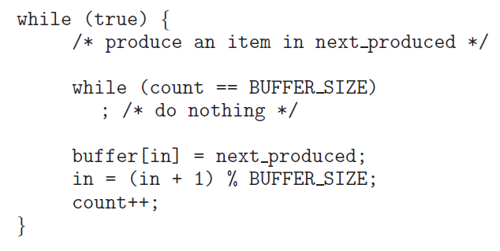

**Data inconsistency : **

- Although two processes are correct separately,
  - they may not function correctly when executed concurrently

- Suppose that the value of count is currently 5,
  - the producer and consumer concurrently execute
  - two statements: `count++;` and `count--;`
- Then, the value of the variable count may be 4, 5, or 6!
  - is it possible ?

**간단한 예시**

- 다음 프로그램의 출력값은? 

```c
#include <stdio.h>
#include <pthread.h>
int sum = 0;

void *run(*void param)
{
    int i
    for (i = 0; i < 10000; i++) {
        sum++;
    }
    pthread_exit(0);
}
int main()
{
    pthread_t tid1, tid2;
    pthread_create(&tid1, NULL, run, NULL);
    pthread_create(&tid2, NULL, run, NULL);
    pthread_join(tid1, NULL);
    pthread_join(tid2, NULL);
    printf(("%d n", sum);
}
```

- main thread create tid1, tid2
  - main 은 tid1, tid2 의 종료를 기다린다. 
  - tid1, tid2 는 context switch 를 하면서 concurrent 하게 실행될 것 
- sum 이 전역변수이므로, 각각의 thread 에서 sum 을 10000씩 증가시켜, 20000이 될 것이라 예상.
  - BUT, 계산할 때 마다 값이 다르고, 16833 같은 이상한 값도 나온다. 

- 또 다른 예제 

```c
#include <stdio.h>
#include <pthread.h>
int sum = 0;

void *run1(*void param)
{
    int i
    for (i = 0; i < 10000; i++) {
        sum++;
    }
    pthread_exit(0);
}
void *run2(*void param)
{
    int i
    for (i = 0; i < 10000; i++) {
        sum--; // 감소 
    }
    pthread_exit(0);
}
int main()
{
    pthread_t tid1, tid2;
    pthread_create(&tid1, NULL, run1, NULL);
    pthread_create(&tid2, NULL, run2, NULL);
    pthread_join(tid1, NULL);
    pthread_join(tid2, NULL);
    printf(("%d n", sum);
}
```

- 마찬가지로 0 이 출력될 때도 있고, 아닐 때도 있다. 
- 또한, for loop 을 100 회 정도로 낮추면 또 정상적으로 동작한다. 

**WHY?**

- Note that two statements  `count++` and `count--`
  - may be implemented in machine language as follows :

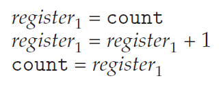  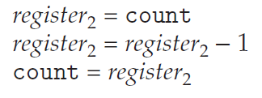

- Even though `𝑟𝑒𝑔𝑖𝑠𝑡𝑒𝑟1`and `𝑟𝑒𝑔𝑖𝑠𝑡𝑒𝑟2` may be the same physical register,
  - the contents of these ***registers*** will be
  - saved and restored by the interrupt handler (or scheduler)
- ex)  count = 5 인 상황에서 run1 이 restore 되면, 
  - register1 에 5 라는 값이 저장되고, 1을 더하므로 register 에 6 이라는 값이 저장
  - 그러나, 이때 context switch 가 발생해서 run1 은 ready queue로, run2 가 restore 되면
  - register2 에는 여전히 count = 5 이므로 5 가 저장되고, 연산 후에 count 에 다시 4 가 저장된다.
  - 이 때 다시 context switch 가 발생하면, count 에 4 가 저장된 상태에서, register1 에는 6이 저장되어 있으므로 count 에는 결과적으로 6이 저장된다 . 

- The concurrent execution of `count++` and `count--`
  - is equivalent to a sequential execution
  - in which the lower level statements presented previously
  - are ***interleaved*** in some ***arbitrary order***
  - 임의적인 순서로 interleave 되면, data integrity 가 깨진다. 

 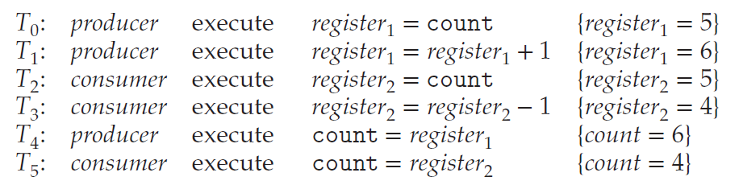

**Race Condition :**

- A situation 
  - where several processes (or threads)
  - access and manipulate the same (or shared) data concurrently
  - and the outcome of the execution
  - depends on the particular order in which the access takes place.
  - data 를 공유하는 상황에서 실행 결과가 process 혹은 thread 의 순서에 의존하는 경우.

**To guard against the race condition**

- We need to ensure that
  - ***only one process at a time*** can manipulate the shared data (e.g. the variable count)
- To make such a guarantee,
  - we require that the processes are ***synchronized*** in some way.
  - to say, process (or thread) synchronization
- 따라서 shynchronization 은 race condition 을 막기 위한 방법이다. 

**Race Condition in Java Threads :**

```java
public class RaceCondition1 {
    public static void main(String[] args) throws Exception {
        RunnableOne run1 = new RunnableOne();
        RunnableOne run2 = new RunnableOne();
        Thread t1 = new Thread(run1);
        Thread t2 = new Thread(run2);
		t1.start(); t2.start();
        t1.join(); t2.join();
        System.out.println("Result: "+ run1.count + ", "+ run2.count);
    }
}
class RunnableOne implements Runnable {
    int count = 0;
    
    @Override
    public void run() {
        for (int i = 0; i < 10000; i++) {
            count++;
        }
    }
}
```

- at Java
  - 생성된 `RunnableOne` 객체의 `count` 변수가 다른 영역에 있으므로, 경쟁 상태가 아니다 .

- count 를 static 으로 선언하면 같은 클래스 변수를 공유하므로 
  - RunnableTwo.count 를 호출하게 되면, 역시 race condition 발생 

```java
class RunnableOne implements Runnable {
    static int count = 0;
    
    @Override
    public void run() {
        for (int i = 0; i < 10000; i++) {
            count++;
        }
    }
}
```

**Exercise 6.6**

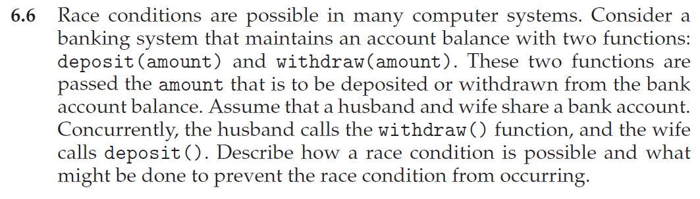

- 입출금 상황도 producer consumer 상황과 동일하다 

****

### 6.2 The Critical Section Problem

**The Critical Section Problem :**

- Consider a system consisting of 𝑛processes {𝑃0,𝑃1,⋯,𝑃𝑛−}
  - Each process has *a segment of code* , called a ***critical section***. (임계영역)
  - in which the process may be accessing (and updating) data
  - that is shared with at least one other process.
- The important feature of the system is that,
  - when one process is executing in its critical section
  - no other process is allowed to execute in its critical section.
  - 하나의 프로세스가 critical section 을 실행 중일 때는, 다른 프로세스가 그 critical section 을 실행할 수 없도록 하자 

- No two processes are executing in their critical sections at the same time.
- To design a protocol that
  - the processes can use to ***synchronize*** their activity
  - so as to ***cooperatively*** share data.

**Sections of codes : **

- The ***entry-section*** : the section of code
  - to request permission to *enter* its critical section. (critical section 에 진입했음을 알린다.)
- The ***critical-section*** follows the entry section. (`count++` & `count--`)
- The ***exit-section*** follows the critical section.
- The ***remainder-section*** is the section of remaining code.

 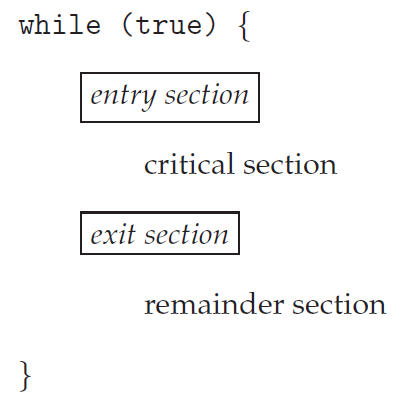

**Three requirements for the solution :**

- ***Mutual Exclusion*** : (default)
  - If process 𝑃𝑖 is executing in its critical section,
  - then no other processes can be executing in their critical section.
- ***Progress*** : (avoid *deadlock*)
  - If no process is executing in its critical section and some processes wish to enter their critical section,
  - then the selection of next process will enter its critical section next ***cannot be postponed indefinitely***
  - deadlock : 다음으로 critical section 에 진입하기 위해 대기 중인 process 중 아무도 진입하지 못하는 상황 
- ***Bounded Waiting*** : (avoid *starvation*)
  - A bound (or limit ) on the number of times that other processes are allowed to enter their critical sections
  - after a process has made a request to enter its critical section and before that request is granted.
  - starvation : CPU scheduling 에서 배움.  우선순위가 낮아서 무한 대기 하는 경우.. 없어야 함 
  - 따라서 waiting 에 제한을 두자 => bounded waiting 

**Example of race condition:**

 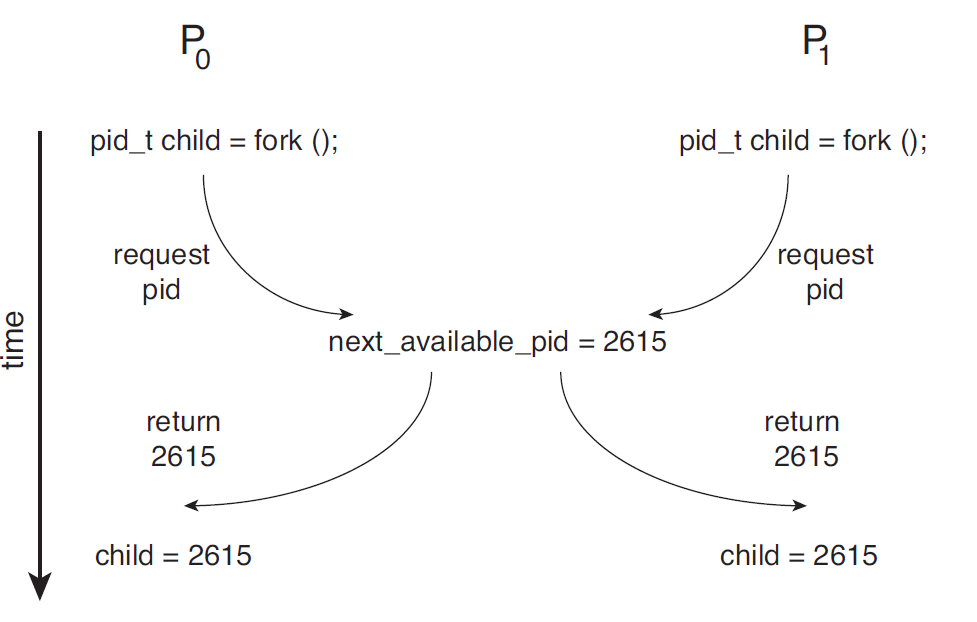

- `fork()` 시에 child 에게 pid 를 부여해야 하는데, 만약 `fork()` instruction 수행 중에 context switch 발생하면 꼬인다!

**A simple solution in a single core environment :** (단순 해결책)

- Prevent interrupts from occurring
  - while a shared variable was being modified.
  - disable interrupt! => context switch 발생하지 않도록
- We could be sure that
  - the current sequence of instructions would be allowed to *execute* in order *without preemption*
  - No other instructions would be run,
  - so no unexpected modifications could be made to the shared data.
  - 예측 불가한 modification 은 없는 반면에, 
- Unfortunately, *not feasible in a multiprocessor environment.*
  - 모든 process 의 interrupt 를 막아야 하는데, 이럴 경우 시스템 성능이 매우 저하된다.

**Two general approaches :**

- preemptive kernels and non-preemptive kernels.
- Non-preemptive kernel
  - a kernel mode process will run
  - until it exits kernel mode, blocks, or voluntarily yields the CPU.
  - essentially free from race conditions on kernel data structures.
  - non-preemptive 의 경우 race condition 발생할 일이 없다. => 자발적 종료를 기다리므로 
  - 그러나 현대에는 사용하지 않는다.. 성능이 느리므로 
- Preemptive kernel
  - allows a process to be preempted when it is running in kernel mode.
  - essentially difficult to design,
  - but *favorable* since it may be more *responsive*.

****

### 6.3 Peterson's Solution 

**Software Solutions to the Critical Section Problem :**

- ***Dekker’s Algorithm*** :
  - for two processes (refer to Exercise 6.13)
- ***Eisenberg and McGuire’s Algorithm***:
  - for `𝑛` processes with a lower bound on waiting of `𝑛 −1` turns (refer to Exercise 6.14)

- ***Peterson’s Algorithm*** :
  - a classic software solution to the critical section problem.
  - no guarantees that Peterson’s solution will work correctly,
  - since modern computers perform basic machine language instructions
  - such as load and store 
- ***Bakery algorithm*** : 
  - not on our book 

**Peterson's solution**

- restricted to two processes that alternate execution
  - between their critical sections and remainder sections.

 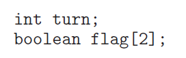 

**Figure 6.3** The structure of process `𝑃𝑖` in Peterson’s solution.

- i 는 => j 의 turn 일 때는 while 문을 통해 기다리다가, while 문을 빠져나오면 critical section 에 진입
- 이를 통해 i 와 j 가 동시에 critical section 에 진입할 수 없게 한다. 

**A simple implementation of Peterson’s solution :**

```c
#include <stdio.h>
#include <pthread.h>
#define true 1
#define false 0

int sum = 0;
    
int turn;
int flag = 2;
    
int main()
{
    pthread_t tid1 tid2;
    pthread_create(&tid1, NULL, producer, NULL);
    pthread_create(&tid2, NULL, consumer, NULL);
    pthread_join(tid1, NULL);
    pthread_join(tid2, NULL);
    printf("sum = %d\n", sum);
}
```

```c
void producer(void *param)
{
    int k;
    for (k = 0; k < 10000; k++) {
        /* entry section */
        flag[0] = true;
        turn = 1;
        while (flag[1] && turn == 1)
            ;
        /* critical section */
        sum++;
        /* exit section */
        flag[0] = false;

        /* remainder section */
    }
	pthread_exit(0);
}

void consumer(void *param)
{
    int k;
    for (k = 0; k < 10000; k++) {
        /* entry section */
        flag[1] = true;
        turn = 0;
        while (flag[0] && turn == 0)
            ;
        /* critical section */
        sum--;
        /* exit section */
        flag[1] = false;

        /* remainder section */
    }
	pthread_exit(0);
}
```

**What happen?**

- 저번처럼 큰 오차가 나지는 않지만, 여전히 소수의 동기화 실패가 발생한다. 

- There are *no guarantees* that
  - Peterson’s solution will *work correctly*
  - if the architecture perform basic machine language instructions,
  - such as load and store
  - entry section 에서 context switch 가 발생할 시 또 문제가 생긴다. 
- However, Peterson’s solution provides
  - a good algorithmic description of solving the CSP.
  - illustrates some of the complexities involved in
  - the requirements of mutual exclusion , progress , and bounded waiting
  - 개념적으로 완벽함. 상호배제, no deadlock, no starvation 

**Peterson’s solution is provably correct**

- Mutual exclusion is preserved.
  - Note that each `𝑃𝑖` enters its critical section,
  - only if either `flag[j] == false` or `turn == i`


- The progress requirement is satisfied. ( No deadlock ) 

- The bounded waiting requirement is met. ( No starvation )

****

### 6.4 Hardware support for Synchronization 

**Hardware based Solutions**

- instruction level 에서 원자성을 보존하기 어렵다. 

- ***Hardware instructions*** that provide
  - support for solving the critical section problem.
  - can be used directly as synchronization tools
  - can be used to form the foundation of more *abstract* mechanisms
- Three primitive operations
  - ***memory barriers or fences***
  - ***hardware instructions***
  - ***atomic variables***

**Atomicity : **

- 원자성 
- An ***atomic operation*** is *one uninterruptible unit* of operation.
- Modern computer systems provide special hardware instructions
  - i.e., atomic instructions
  - that allow us either to *test and modify* the content of a word
  - or to *test and swap* the contents of two words
- Hardware 설계로 modify 또는 swap 동작을 하나의 회로로 one clock 에 해결할 수 있도록 하자.

- Two types of conceptual atomic instructions:
  - `test_and_set()` and `compare_and_swap()`
  - 단위 operation 으로 중간에 interrupt 가 불가하다. 

**The `test_and_set()` instruction : **

 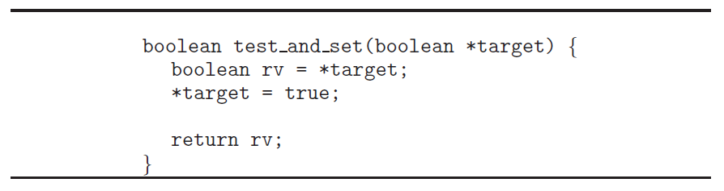

- A global Boolean variable `lock`
  - is declared and initialized to `false`

 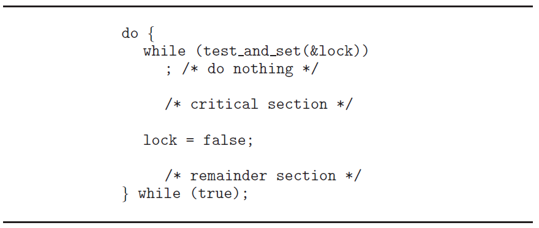

- mutual exclusion 을 확실히 보장 

**The `compare_and_swap()` instruction : **

 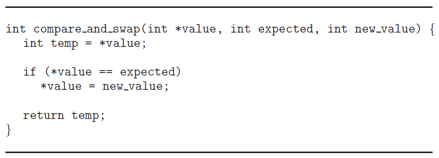

- A global Boolean variable `lock`
  - is declared and initialized to `0`

 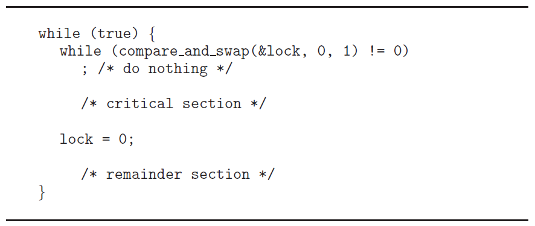

****

**Atomic Variable**

- Typically, the `compare_and_swap()` instruction
  - is used for construction other tools such as an atomic variable
- An *atomic variable* provides
  - atomic operations on basic data types such as integers and Booleans.
  - can be used to ensure mutual exclusion in situations
  - where there may be a ***single variable*** with *race condition*

**Java implementation of Peterson’s solution :**

```java
public class Peterson1 {
    static int count = 0; // static 
        
    static int turn = 0;
    static boolean[] flag = new boolean [2];
    
    public static void main(String[] args ) throws Exception {
        Thread t1 = new Thread(new Producer()); // Producer need to be static
        Thread t2 = new Thread(new Consumer()); // Consumer need to be static
        t1.start(); t2.start();
        t1.join(); t2.join();
        System.out.println(Peterson1.count);
    }
    
    static class Producer implements Runnable {
        @Override
        public void run() {
            for (int k = 0; k < 10000; k++) {
                /* entry section */
                flag[0] = true;
                turn = 1;
                while (flag[1] && turn == 1)
                    ; // wait

                /* critical section */
                count++;

                /* exit section */
                flag[0] = false;

                /* remainder section */
            }
        }
    }

    static class Consumer implements Runnable {
        @Override
        public void run() {
            for (int k = 0; k < 10000; k++) {
                /* entry section */
                flag[1] = true;
                turn = 0;
                while (flag[0] && turn == 0)
                    ; // wait

                /* critical section */
                count++;

                /* exit section */
                flag[1] = false;

                /* remainder section */
            }
        }
    }
}
```

**Java implementation with atomic variable**

- `AtomicBoolean` made of `compare_and_swap`

```java
import java.util.concurrent.atomic.AtomicBoolean;

public class Peterson2 {
    static int count = 0; // static 
        
    static int turn = 0;
    static AtomicBoolean[] flag; 
    static {
		flag = new AtomicBoolean[2];
        for (int i = 0; i < flag.length; i++)
            flag[i] = new AtomicBoolean();
    } // static 생성자 
    
    static class Producer implements Runnable {
        @Override
        public void run() {
            for (int k = 0; k < 10000; k++) {
                /* entry section */
                flag[0].set(true);
                turn = 1;
                while (flag[1].get() && turn == 1)
                    ; // wait

                /* critical section */
                count++;

                /* exit section */
                flag[0].set(false);

                /* remainder section */
            }
        }
    }

    static class Consumer implements Runnable {
        @Override
        public void run() {
            for (int k = 0; k < 10000; k++) {
                /* entry section */
                flag[1].set(true);
                turn = 0;
                while (flag[0].get() && turn == 0)
                    ; // wait

                /* critical section */
                count++;

                /* exit section */
                flag[1].set(false);

                /* remainder section */
            }
        }
    }
}
```

- 이 경우엔, 오차가 없이 완벽하다. 


