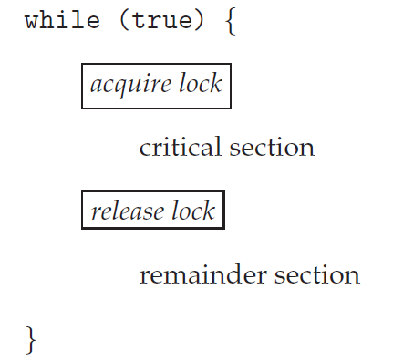
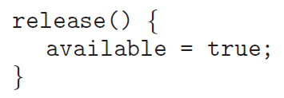
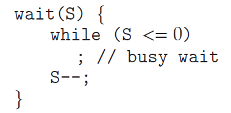
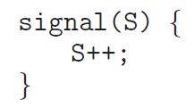
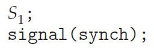
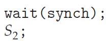
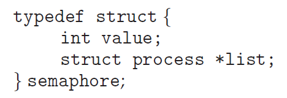
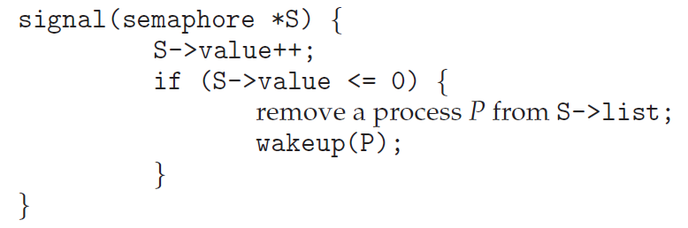

# OS06 : Synchronization Tools 02

[인프런 **운영체제 공룡책 강의**](https://www.inflearn.com/course/%EC%9A%B4%EC%98%81%EC%B2%B4%EC%A0%9C-%EA%B3%B5%EB%A3%A1%EC%B1%85-%EC%A0%84%EA%B3%B5%EA%B0%95%EC%9D%98/dashboard) 를 듣고 정리한 내용입니다. 

## Synchronization Tools 02

### 6.5 Mutex Locks

**Higher-level software tools to solve the CSP : **

- ***Mutex Locks*** : the simplest tools for synchronization. => control 2
- ***Semaphore*** : more robust, convenient, and effective tool. => control N
- ***Monitor*** : overcomes the demerits of mutex and semaphore.
- ***Liveness*** : ensures for processes to make progress. (deadlock 까지 해결)

**Mutex Lock**

- mutex : mutual exclusion
- to protect critical section and prevent race condition.
- a process must *acquire* the *lock* before entering a critical section.
- *releases* the *lock* when it exits the critical section.
- 열쇠를 얻고, 반납한다. 

**Two functions and one variable for the Mutex Locks :**

- `acquire()` and `release()`
- `available` : a Boolean variable whose value indicates
  - if the lock is available or not. (열쇠의 상태를 나타냄)

 

**The definition of acquire() and release() :**



- calls to either `acquire()` and `release()` must be performed *atomically*.
- can be implemented using the `compare_and_swap` operation.

**Busy waiting**

- Any other process trying to enter its critical section
  - must loop continuously in the call to `acquire()`.
- *Busy waiting* is clearly a problem in a real multiprogramming system,
  - where a single CPU core is shared among many processes.
  - wastes CPU cycles for some other processes to use productively.
  - while 문을 계속해서 돌기 때문에, CPU 를 잡아먹는다. (마치 공회전)

**Spinlock :**

- the type of mutex lock using the method of busy waiting.
- the process spins while waiting for the lock to become available.
- However, spinlocks do have an advantage (유용한 경우가 있다!)
  - in that no context switch is required waiting on a lock.
  - a context switch may take considerable time.
  - waiting 하는 동안은 context switch 가 발생하지 않아서 좋다.  
- In certain circumstances on *multicore systems*
  - spinlocks are the **preferable** choice for locking.
  - One thread can spin on one processing core
  - while another thread performs its critical section on another core
  - spin 하고 있는 thread 가, 대기하고 있다가 another thread 가 끝나면 context switch 없이 바로 실행 가능

```c
void *counter(void param)
{
    int k;
    for (k = 0; k < 10000; k++) {
        /* entry section */
        pthread_mutex_lock(&mutex) // easier than peterson's algorithm

        /* critical section */
        sum++;

        /* exit section */
        pthread_mutex_unlock(&mutex);
        /* remainder section */
    }
    pthread_exit(0);
}
```

```c
#include <stdio.h>
#include <pthread.h>

int sum = 0;
    
pthread_mutex_t mutex;
    
int main()
{
    pthread_t tid1 tid2;
    pthread_mutex_init(&mutex, NULL);
    pthread_create(&tid1, NULL, counter, NULL);
    pthread_create(&tid2, NULL, counter, NULL);
    pthread_join(tid1, NULL);
    pthread_join(tid2, NULL);
    printf("sum = %d\n", sum);
}
```

- 그러나, mutual exclusion 은 만족하지만 deadlock, starvation 해결하지 못함 

### 6.6 Semaphores

**Semaphore**

- semaphore : 신호장치, 신호기 

**Defining the Semaphore**

- A semaphore `𝑆` is
  - an integer variable that, apart from initialization,
  - is accessed only through *two standard atomic operations* :
  - `wait()` and `signal()`, or sometimes `P()` and `V()`
    - `P()` and `V()` are introduced by Edsger Dijkstra
    - Proberen (to test) and Verhogen (to increment)

**Definition of wait() and signal() :**

 

- 열쇠가 여러개라고 생각하면 된다! (ex. S = 10) .. 목욕탕 열쇠.. 
- All modifications to the integer value of the semaphore
  - in the `wait()` and `signal()` operations must be executed atomically

**Binary and Counting Semaphores**

- *Binary* Semaphore
  - range only between 0 and 1 => similar to *mutex lock*
  - S = 1 이면, 결국 mutex lock 과 동일하다. 
- *Counting* Semaphore
  - range over an unrestricted domain.
  - can be used to resources with *a finite number of instances*
  - S = n (n > 1)

**Using the counting semaphore**

- Initialize a semaphore to the number of resources available
- When a process uses a resource
  - `wait()` on the semaphore: *decrements* the count
- When a process release a resource
  - `signal()` on the semaphore: *increment* the count
- When the count *goes to 0*, all resources are being used.
  - Then, processes that wish to use a resource will *block*
  - until the count becomes greater than 0

**Using the semaphore to solve synchronization problem :**

- Consider two processes 𝑃1and 𝑃2running concurrently.
  - `𝑃1` with a statement `𝑆1`, and `𝑃1` with a statement `𝑆2`
- Suppose that `𝑆2` should be executed only after `𝑆1` has completed.
  - Let `𝑃1` and `𝑃2` share a semaphore *synch* , initialized to 0
- 만약, S2 가 S1 이후에 실행되도록 하려면, P1, P2 는 synchronization 되어 있어야 한다. 

 

- 한쪽은 signal 을 주고, 한쪽은 wait 하고.

**Semaphore Implementation :** 

- Semaphores also suffer from the problem of busy waiting
- To overcome this problem, modify the definition of `P()` and `V()`.
- When a process executes the `wait()` operation
  - and finds that the semaphore is not positive , it must wait.
  - rather than busy waiting, *suspend* itself and goes to the *waiting queue*.
  - => while 문을 돌면서 wait 하지 말고, suspend, 즉 waiting queue 로 진입함
- When other process executes the `signal()` operation
  - waiting processes can be *restarted* and placed into the *ready queue*

 



- wait 해야 할 때는, list 에 넣고, wait queue 로 이동.
- signal 이 오면, list 에서 빼고, ready queue 로 이동.

```c
void *counter(void param)
{
    int k;
    for (k = 0; k < 10000; k++) {
        /* entry section */
        sem_wait(&sem)

        /* critical section */
        sum++;

        /* exit section */
        sem_post(&sem)
        /* remainder section */
    }
    pthread_exit(0);
}
```

```c
#include <stdio.h>
#include <pthread.h>
#include <semaphore.h>

int sum = 0;
    
sem_t sem;
    
int main()
{
    pthread_t tid1 tid2;
    sem_init(&sem, 0, 1); // s = 1
    pthread_create(&tid1, NULL, counter, NULL);
    pthread_create(&tid2, NULL, counter, NULL);
    pthread_join(tid1, NULL);
    pthread_join(tid2, NULL);
    printf("sum = %d\n", sum);
}
```

- counting semaphore

```c
int main()
{
    pthread_t tid[5]; int i;
    sem_init(&sem, 0, 5); // s = 5 
    for (i = 0; i < 5; i++)
    	pthread_create(&tid[i], NULL, counter, NULL);
    for (i = 0; i < 5; i++)
    	pthread_join(tid[i], NULL); 
    
    printf("sum = %d\n", sum);
}
```

- 50000 이 나와야 하지만, 그렇지 못하다. 
  - 5개의 thread 가 열쇠를 가지고 critical section 에 진입하게 된다 => race condition !!!!
  - semaphore 는 N 개의 instance 가 존재하는 것을 전제 조건으로 한다. 
  - 하나의 sum 에 대해서는 여전히 race condition 
  - sum 변수를 5개 생성하여 각각 계산하면 문제 없다. 

- 얘를 들어 thread 가 100 개이고, semaphore S = 5 이면,  5개 thread 가 동시에 동작하고, 95 개는 대기한다. 

  


