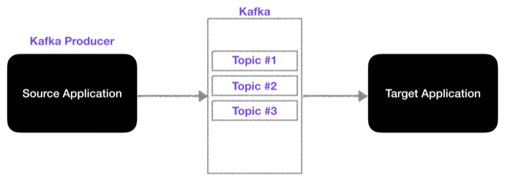
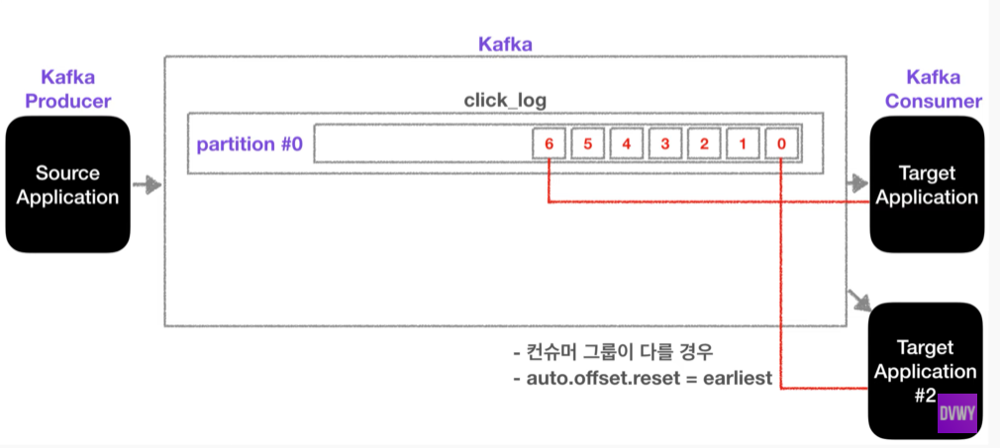
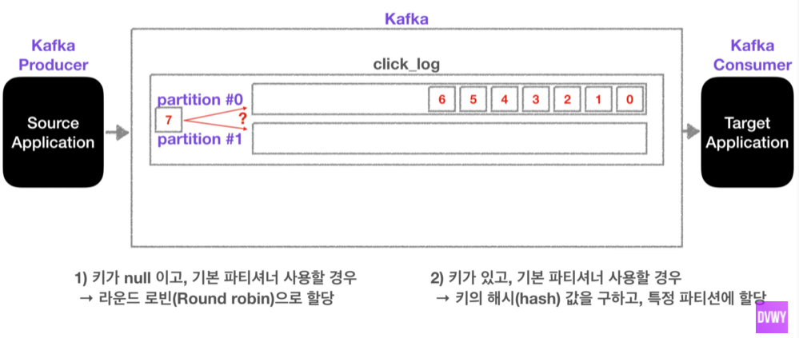

# Project Note: Kafka

> [Basic of BIGDATA 💁What is apache kafka?](https://www.youtube.com/watch?v=waw0XXNX-uQ)
>
> [데이터💾가 저장되는 토픽에 대해서 알아봅시다.](https://www.youtube.com/watch?v=7QfEpRTRdIQ&list=PL3Re5Ri5rZmkY46j6WcJXQYRlDRZSUQ1j&index=2)

## Intro 

### **Before Kafka** 

데이터를 전송하는 Source Application 과 데이터를 받는 Target Application 간의 간단한 단방향 통신의 경우, 

Source 와 Target Application 의 갯수가 늘어날수록 복잡도가 늘어나고, 데이터 전송 라인도 많아진다. 

데이터 전송 라인이 많아지면 배포와 장애에 대응하기 어렵다. 

또한 데이터 전송 시 protocol format 의 파편화가 심해진다. 추후에 format 변경 사항이 있을 경우 유지 보수가 매우 어렵다. 

이러한 복잡성을 해결하기 위해 Linked In 에서 Kafka 를 개발하여 오픈소스로 제공하였다. 

### Kafka

Source 와 Target Application 사이의 coupling 을 약하게 한다. 

Source 는 Kafka 에 데이터를 전송하고, Target 은 Kafka 에서 데이터를 가져온다. 

예를 들어, Source 에서 로그 데이터를 Kafka 에 보내면 Target 에서는 Kafka 에서 로그 데이터를 가져와 적재하거나 이를 처리한다.  

Source 에서 보낼 수 있는 데이터의 형식에는 거의 제한이 없다. 

Kafka 에는 Topic 이라는 개념이 있으며, 데이터를 저장하는 Queue 라고 보면 된다. 

데이터를 보내고 받는 역할은 Kafka Producer 와 Consumer 가 담당하는데, 이는 라이브러리 형식으로 되어 있어 구현이 가능하다. 

결론적으로, Kafka 가 아주 유연한 Queue 역할을 한다고 보면 되고, 데이터 흐름에 있어 fault tolerant (고가용성) 로 서버에 생긴 이슈 상황에 대응하여 데이터를 손실 없이 복구할 수 있다.  

또한 낮은 지연 (latency) 와 높은 처리량 (Throughput) 을 통해서 효과적으로 데이터를 처리할 수 있다. 

따라서 빅데이터 처리에서 필수이다!

## Topic

- 다양한 데이터를 저장하는 공간, 일반적인 AMQP 와는 다르게 동작한다. 

- 데이터 베이스의 테이블이나, 파일 시스템의 폴더와 유사한 성질을 가지고 있다. 

- Topic 은 목적에 따라 click_log, send_sms, location_log 등 이름을 지정할 수 있다. 
  - 명확한 이름을 통해 유지 보수 시 편리하게 관리할 수 있다. 

- 하나의 Topic 은 여러 개의 partition 으로 구성될 수 있으며, partition 은 `#0` 부터 시작한다. 

- 하나의 partition 은 Queue 와 같이 내부에 producer 로 부터 받은 데이터가 끝에서부터 차곡차곡 쌓인다. 

- consumer 는 데이터를 가장 오래된 순서대로 가져가게 된다. 

  - 더이상 데이터가 들어오지 않으면, consumer 는 또 다른 데이터가 들어올 때까지 기다린다. 

  - consumer 가 데이터를 가져가더라도, 데이터는 삭제되지 않고 partition 에 그대로 남게 된다. 

- 새로운 consumer 가 붙게 되면, 다시 0번 데이터부터 가져갈 수 있다. 

  - 다만, consumer 그룹이 달라야 하고, `auto.offset.reset = earliest` 로 설정되어 있어야 한다. 

  - 이러한 방법으로 **동일한 데이터를 2번 처리**할 수 있는데, 
  - **같은 데이터**를 ElasticSearch 에 저장하고, 또 백업을 위해 Hadoop 에 저장하는 것이 가능하다. 

- partition 이 2개 이상인 경우, producer 가 데이터를 보낼 때 키를 지정하여 어느 partition 에 데이터를 쌓을 지 정할 수 있다. 
- 키가 null 이고 기본 파티셔너를 사용할 경우 
  - 라운드 로빈으로 할당 
- 키가 있고, 기본 파티셔너를 사용할 경우 
  - 키의 해시 값을 구하여 특정 partition 에 할당 

- partition 을 늘릴 때는 매우 신중해야 한다. partition 을 다시 줄일 수 없다!! 
  - partition 을 늘려 데이터 처리를 분산시킬 수 있다. 
  - partition 의 데이터가 삭제되는 타이밍은 옵션에 따라 다른데, 저장되는 최대 시간과 크기를 지정할 수 있다. 
    - `log.retention.ms` : 최대 record 보존 시간 
    - `log.retention.byte` : 최대 record 보존 크기 (byte)
