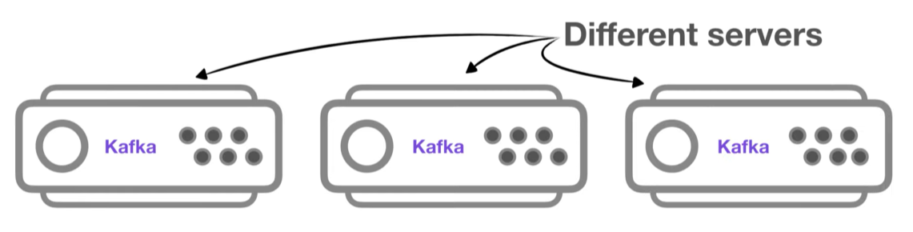
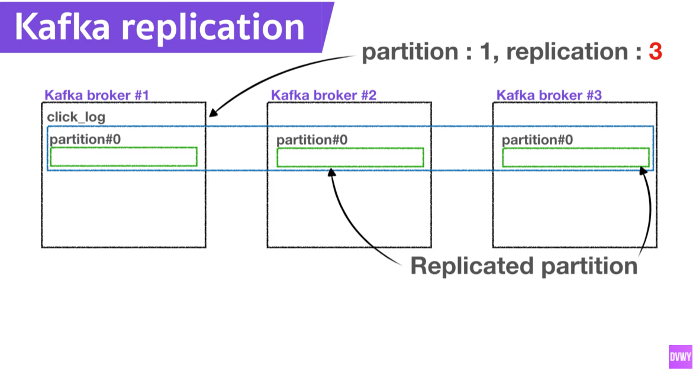
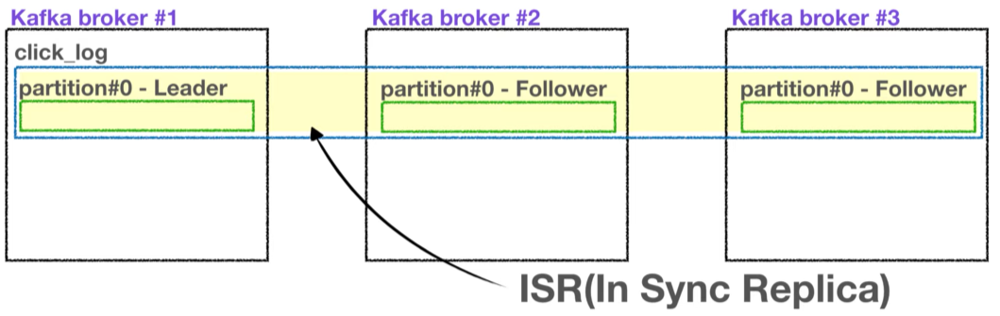
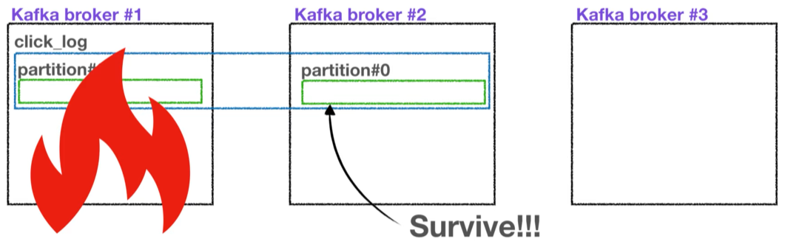

# Project Note: Kafka Broker

>[Broker, Replication, ISR 👀핵심요소 3가지!](https://www.youtube.com/watch?v=qpEEoGpWVig&list=PL3Re5Ri5rZmkY46j6WcJXQYRlDRZSUQ1j&index=4)

카프카 운영의 핵심 요소 3가지!

## Broker, Replication 

카프카가 설치되어 있는 서버 단위

- 보통 3개 이상의 Broker 로 구성하여 사용하는 것을 권장 

**Replication** 

- partition 의 복제를 뜻한다. 

- 카프카 아키텍처의 핵심

- 클러스터에서 서버에 장애가 생길 때, 카프카의 고가용성을 보장하는 가장 좋은 방법 

- 위와 같이 replication 이 3 이라면, partition 은 원본 1개와 복제본 2개로 총 3개가 존재하게 된다. 

  - 여기서 원본을 **Leader partition**,
  - 나머지 복제본을 Follower partition, 
  - 이 3개를 통틀어 **ISR(In Sync Replica)** 라고 부른다.

  

- broker 개수에 따라 replication 의 개수가 제한된다. 

  - broker 개수가 3이면, replication 은 4가 될 수 없다. 

**Why replicate?**

만약 partition 이 1개이고, replication 이 1인 topic 이 존재하고 브로커가 3대라면,  브로커 3대 중 1대에 해당 topic 의 데이터가 저장된다.  

만약 브로커 #1 어떠한 이유로 사용불가하게 된다면, 더 이상 해당 파티션을 복구할 수 없다. 

만약 replication 이 2라면, 브로커 한 개가 사용 불가해도, 복제본 즉 Follower partition 이 존재하므로 복제본으로 복구가 가능하다. 

**ack option**

Kafka-client Producer 가 Topic 의 partition 으로 데이터를 전달할 때, 전달 받는 주체는 Leader partition 이다. 

프로듀서에는 ack 라는 상세 옵션이 있고, 고가용성을 유지할 수 있는데, 이는 replication과 관련이 있다. 

3 options of ack 

- `ack = 0 ` 

  -  프로듀서가 Leader partition 에 데이터를 전송하고 응답 값을 받지 않는다. 
  - 데이터가 정상적으로 전송되었는지, 그리고 나머지 partition 에 정상적으로 복제되었는지 알 수 없고 보장할 수 없다.
  - 속도는 빠르지만 데이터 유실 가능성이 있다.  

- `ack = 1`

  - Leader partition 에 데이터를 전송하고, 정상적으로 받았는지 응답값을 받는다. 
  - 다만 나머지 partition 에 정상적으로 복제되었는지 알 수 없다. 
  - 만약 Leader partition 이 데이터를 받은 즉시 브로커가 장애가 나면, 데이터 유실 가능성이 있다. 

- `ack = all `

  - 1 옵션에 추가로 Follower partition 에 복제가 잘 이루어졌는지 응답값을 받는다. 

  - 데이터 유실은 없지만, 확인하는 부분이 많기 때문에 속도가 현저히 느리다. 

**Replication count**

replication 개수가 많아지면, 브로커의 리소스 사용량도 늘어난다. 

따라서 카프카에 들어오는 데이터량과 retention date, 즉 저장 시간을 잘 생각하여 개수를 정하는 것이 좋다. 

3개 이상의 브로커를 사용할 때, replication 은 3으로 설정하는 것을 추천한다. 

