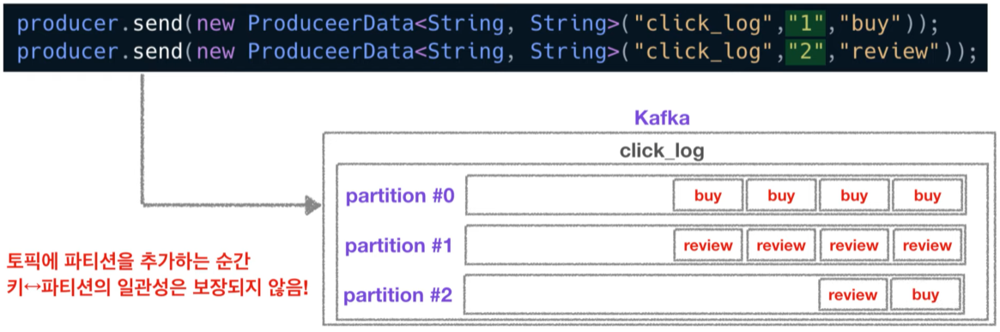

# Project Note: Kafka Producer

> [데이터를 카프카로 전송🚀하는 프로듀서](https://www.youtube.com/watch?v=aAu0FE3nvbk&list=PL3Re5Ri5rZmkY46j6WcJXQYRlDRZSUQ1j&index=3)

## Producer 

### Role

데이터를 카프카로 보내는 역할. 

예를 들어, 엄청난 양의 클릭 로그 들을 대량, 실시간으로 카프카에 적재할 때 사용할 수 있다. 

자세한 역할은 다음과 같다. 

1. Topic 에 해당하는 메시지를 생성
2. 특정 Topic 으로 데이터를 publish 
3. 전송 성공 여부를 확인 => 처리 실패 시 재시도 


### How

카프카 클라이언트인 컨슈머와 프로듀서를 사용하기 위해선, Apache Kafka 라이브러리를 추가해야 한다. 

>[Kafka Java Client](https://docs.confluent.io/clients-kafka-java/current/overview.html)
>
>[Getting Started with Apache Kafka and Java](https://developer.confluent.io/get-started/java?_ga=2.72997267.1017791110.1649984112-1877703682.1649984112&_gac=1.215348709.1649984123.Cj0KCQjwjN-SBhCkARIsACsrBz45ucsYt9TGIIwcOEV-LHhiUd5hxXMiO8c2i6MNJtepzjNG7JIk_soaAm9DEALw_wcB)

그래들, 메이븐 같은 도구를 사용하여 편리하게 추가할 수 있다. 

```java
// gradle
compile group: 'org.apache.kafka', name: 'kafka-clients', version: '2.3.0'
```

``` xml
<!-- maven -->
<dependencies>
    
  <dependency>
    <groupId>org.apache.kafka</groupId>
    <artifactId>kafka-clients</artifactId>
    <version>2.3.0</version>
  </dependency>

  <!-- further dependency entries here -->

</dependencies>
```

카프카 클라이언트를 디펜던시로 잡을 때, 버전에 주의해야 한다. 

브로커 버전과 클라이언트 버전의 하위 호환성이 완벽하게 모든 버전에 대해 지원하지 않는다. 

따라서 브로커와 클라이언트의 하위 호환성에 대해 숙지하고 알맞는 버전을 사용하자!

참고 [Kafka broker와 java client의 버젼 하위호환성 정리](https://blog.voidmainvoid.net/193)


### Code 

```java
public class Producer {
    public static void main(String[] args) throws IOException {
        
        Properties config = new Properties();
        configs.put("client.id", InetAddress.getLocalHost().getHostName());
        // 카프카 브로커의 주소 목록은 2개 이상의 ip 와 port 를 설정하도록 권장하고 있다. 
        configs.put("bootstrap.servers", "host1:9092,host2:9092");
        // 나머지 key, value 에 대해 직렬화 설정
        configs.put("key.serializer", "org.apache.kafka.common.serializtation.StringSerializer");
            configs.put("value.serializer", "org.apache.kafka.common.serializtation.StringSerializer");

        // 카프카 프로듀서 인스터스 생성 
        KafkaProducer < String, String > producer = new KafkaProducer < String, String >(configs);
        // 카프카가 제공하는 전송 객체 사용
        // final ProducerRecord<K, V> record = new ProducerRecord<>(topic, key, value);
        // final ProducerRecord<K, V> record = new ProducerRecord<>(topic, value);
        ProducerRecord record = new ProducerRecord < String, String > ("click_log", "login"); 
        // send() API returns a future which can polled to get result of the send
        Future<RecordMetadata> future = producer.send(record);
        producer.close();
    }
}
```

- 카프카 브로커의 주소 목록은 2개 이상의 ip 와 port 를 설정하도록 권장하고 있다. 
  - 둘 중 한 개의 브로커가 비정상일 경우 다른 브로커에 연결하여 사용 가능하기 때문 
- 나머지 key, value 에 대해 직렬화 설정
  - `Byte array`, `String`, `Integer` Serializer 사용 가능
  - key 는 메시지를 보낼 때 파티션 지정 시 사용 
- `KafkaProducer` 인스턴스와 ,  전송할 객체인 `ProducerRecord`  인스턴스를 생성 

- 위와 같이 key 를 지정해주지 않을 시, Round-Robin 으로 partition 에 데이터가 쌓이게 된다. 

  - 키를 지정할 시 key 를 해시값으로 변형시켜, 각 파티션에 동일한 데이터가 쌓이도록 지정할 수 있다. 
  - key 와 파티션이 서로 매칭되지 않는다면 아래와 같은 문제가 발생한다 

  
