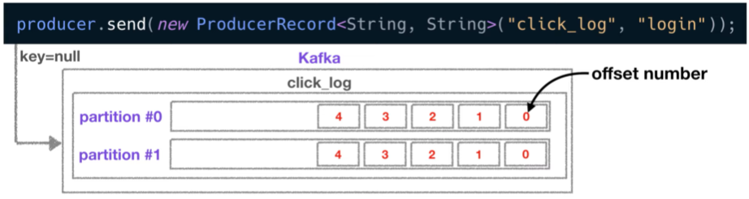
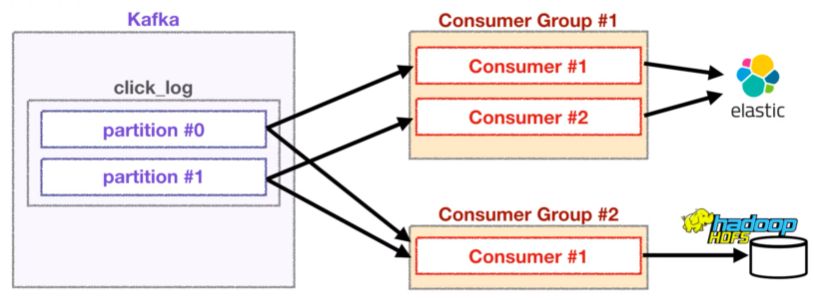

# Project Note: Kafka Consumer

> [카프카 컨슈머 역할 및 코드예제](https://youtu.be/rBVCvv9skT4?list=PL3Re5Ri5rZmkY46j6WcJXQYRlDRZSUQ1j)

## Consumer

카프카의 컨슈머는 다른 데이터 시스템과는 조금 다르다.  

- 보통 데이터 시스템의 컨슈머는 데이터를 가져가면 데이터가 사라진다. 

- 카프카에서는 컨슈머가 데이터를 가져가더라도 데이터가 사라지지 않는다. 


### Role 

1. Topic 의 partition 으로부터 데이터 polling

   - 컨슈머는 기본적으로 토픽의 파티션에 저장된 데이터를 가져오는데, 이 방식을 **polling** 이라고 한다. 

   - 이렇게 가져온 데이터를 데이터베이스에 저장하거나, 또 다른 파이프라인에 전달할 수 있다. 

2. Partition offset 위치 기록 (commit)
   - offset 이란 파티션에 있는 데이터 번호를 뜻한다. 
3. Consumer group 을 통해 병렬 처리 
   - 파티션 개수에 따라 컨슈머를 여러 개 만들면 병렬 처리가 가능하여, 더욱 빠른 속도로 데이터를 처리할 수 있다. 


### Code 

>[Kafka Java Client](https://docs.confluent.io/clients-kafka-java/current/overview.html)
>
>[Getting Started with Apache Kafka and Java](https://developer.confluent.io/get-started/java?_ga=2.72997267.1017791110.1649984112-1877703682.1649984112&_gac=1.215348709.1649984123.Cj0KCQjwjN-SBhCkARIsACsrBz45ucsYt9TGIIwcOEV-LHhiUd5hxXMiO8c2i6MNJtepzjNG7JIk_soaAm9DEALw_wcB)

프로듀서 사용 때와 같이, 라이브러리를 추가해야 한다. (프로듀서 글 참고)

```java
public class Consumer {
    public static void main(String[] args) {
        
        Properties config = new Properties();
        configs.put("client.id", InetAddress.getLocalHost().getHostName());
        // 카프카 브로커의 주소 목록은 2개 이상의 ip 와 port 를 설정하도록 권장하고 있다. 
        configs.put("bootstrap.servers", "host1:9092,host2:9092");
        configs.put("group.id", "click_log_group");
        // 직렬화된 key, value 에 대해 deserialize 설정
        configs.put("key.deserializer", "org.apache.kafka.common.serializtation.StringDeserializer");
            configs.put("value.deserializer", "org.apache.kafka.common.serializtation.StringDeserializer");

        // 카프카 컨슈머 인스터스 생성 
        KafkaConsumer < String, String > consumer = new KafkaConsumer < String, String >(configs);
        consumer.subsribe(Array.asList("click_log"));
        
        while (true) {
            ConsumerRecords <String, String> records = consumer.poll(500);
            for (ConsumerRecord <String, String> record : records) {
                System.out.println(record.value());
            }
        }
    }
}
```

- proptery 설정

  - group id 는 컨슈머 그룹이라고 불리며, 컨슈머들의 묶음이라고 생각하면 된다. 

- `KafkaConsumer` 클래스를 통해 인스턴스를 생성

- `subscribe()` 메서드를 통해 어느 토픽을 대상으로 데이터를 가져올 지 지정  

  - 특정 토픽의 일부 파티션의 데이터만 가져오고 싶다면, `assign()` 메서드를 사용한다. 
  - 이를 통해 키가 존재하는 데이터의 순서를 보장하는 데이터 처리가 가능하다. 

  ```java
  TopicPartition partition0 = new TopicPartition(topicName, 0);
  TopicPartition partition1 = new TopicPartition(topicName, 1);
  consumer.assign(Arrays.asList(partition0, partition1));
  ```

- polling loop 
  - 컨슈머 API 의 핵심은, 브로커로부터 연속적으로, 컨슈머가 허락하는 한 많은 데이터를 읽는 것!
  - `poll()` 메서드가 포함된 무한 루프 
  - `poll() ` 메서드의 인자로 설정한 ms 단위 시간 동안 데이터를 기다린다.
    - 0.5 초 동안 데이터가 도착하기를 기다리고 이후 코드를 실행한다. 
    - 0.5 초 동안 데이터가 도착하지 않는다면 비어있는 records 값을 반환한다.  
  - records 변수는 데이터 배치로서 레코드의 묶음 list 이다 
    - for loop 로 반복 처리하면서 실질적인 데이터인 record 를 가져와 처리한다. 
  - 데이터를 하둡, 엘라스틱서치와 같은 저장소에 저장하는 로직을 주로 넣는다. 


### more

**offset**



- 프로듀서에 의해 전송된, 키를 지정하지 않은 record 는 파티션에 RR 방식으로 저장되며 partition 내에서 고유한 번호를 가지게 되는데, 이를 offset 이라고 한다.   
- offset 은 토픽, 파티션 별로 별개로 지정된다. 
- offset 을 통해 컨슈머가 데이터를 어느 지점까지 읽었는지 확인할 수 있다. 
- 컨슈머가 데이터를 읽기 시작하면 offset 을 commit 하게 되며, 이렇게 가져간 데이터의 정보는 카프카의 `__consumer_offset` 토픽에 저장된다. 
- 만약 컨슈머가 어떤 사고로 실행이 중지되었다가, 재실행하면 offset 에 대한 정보, 즉 데이터를 어디까지 가져왔는지에 대한 정보를 가지고 있으므로 시작위치부터 다시 복구하여 데이터 처리가 가능하다. 
- 고가용성의 특징!!


**Counsumer count**

파티션이 2개이고, 

- 컨슈머가 1개인 경우
  - 1개의 컨슈머가 2개의 파티션에서 데이터를 가져간다. 
- 컨슈머가 2개인 경우 
  - 각 컨슈머가 각각의 파티션을 할당하여 데이터를 가져간다. 
- 컨슈머가 3개인 경우 
  - 이미 파티션들이 각 컨슈머에 할당되었기 떄문에, 할당받지 못한 컨슈머는 동작하지 않는다. 
  - 따라서 Consumer 개수는 partition 개수보다 적거나 같아야 한다. 

**Different groups**



각기 다른 컨슈머 그룹에 속한 컨슈머들은 다른 그룹의 컨슈머에 영향을 미치지 않는다. 

- 만약 Consumer Group #1 의 컨슈머들이 각 파티션에 특정 offset 을 읽고 있어도, 

- Consumer Group #2 의 컨슈머들이 데이터를 읽는 데는 영향을 미치지 않는다. 

- `__consumer_offset` 토픽에는 컨슈머 그룹별, 토픽별로 offset 을 나누어 저장하기 때문!

따라서 다양한 역할을 하는 컨슈머들이 각자 원하는 데이터로 처리할 수 있다. 


