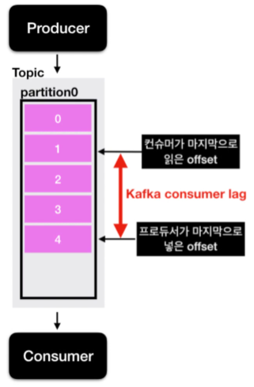

# Project Note: Kafka Burrow

> [카프카 컨슈머 Lag이란?](https://www.youtube.com/watch?v=D7C_CFjrzBk&list=PL3Re5Ri5rZmkY46j6WcJXQYRlDRZSUQ1j&index=8)

## Consumer Lag 

프로듀서가 partition 에 데이터를 넣어주는 속도가, 컨슈머가 데이터를 가져가는 속도보다 빠르게 되면? 

프로듀서가 마지막으로 넣은 offset 과 컨슈머가 마지막으로 읽은 offset 사이의 차이가 발생한다. 

이를 Consumer Lag 이라 한다. 

이 Lag 의 숫자를 통해 현재 해당 토픽에 대한 파이프라인으로 연결되어 있는 프로듀서와 컨슈머의 상태에 대해 유추가 가능하며, 주로 컨슈머의 상태에 대해 볼 때 사용한다. 

컨슈머 그룹이 1개이고, 파티션이 2개인 토픽에서 데이터를 가져간다면, lag 은 2개가 측정 될 수 있다. 

그 중 가장 높은 숫자의 lag 을 records-lag-max 라고 부른다. 

  

