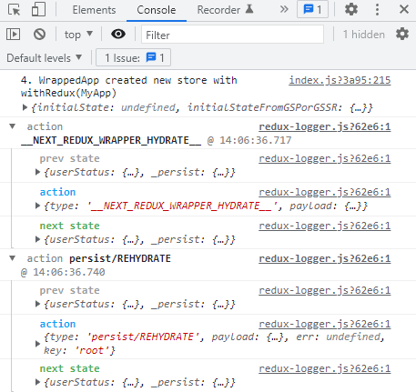

# Project Note : Login redirection

로그인 하지 않은 유저가 특정 페이지에 접근하지 못하도록 구현해보고자 하였다. 

Next.js 에서는 redirection 에 크게 두가지 방법이 존재하는데,

**1. 페이지가 렌더링 된 이후에, client side 에서 `useEffect` 내에서 처리**

```react
  useEffect(() => {
    if (!isLoggedIn) {
      toast.error("로그인이 필요합니다!");
      router.push("/login");
    }
  }, [isLoggedIn, router]);
```

- 이 방법은, 페이지가 렌더 된 이후에 실행되기 때문에,  페이지가 노출되면서 깜빡이는 현상이 존재한다. 

- 이를 조금이라도 방지하기 위해 컴포넌트에서 아래와 같은 코드가 필요하다 

  ```react
    if (!isLoggedIn) {
      return <div></div>;
    }
  ```
  
  - 추가로 loading spinner 등을 렌더링 하면 좋다!

**2. `getServerSideProps` 에서 redirect 기능을 사용**

```react
    if (!isLoggedIn) {
      // toast.error("로그인이 필요합니다.");
      return {
        redirect: {
          destination: "/login",
          permanent: false,
        },
      };
    }
```

그러나 나의 경우엔, `isLoggedIn` 상태를 redux state 로 관리하는데, server side rendering 시 작동하는 `getServerSideProps` 내에서 redux state 를 불러오는 것이 쉽지 않았다. 

그 이유는

1. redux store 는 페이지가 새로고침 될 때마다 새로 생성되는 특징이 있는데, 

2. 나의 경우엔 redux-persist 를 이용하여 localstorage 에 state 를 저장했다가 hydrate 하는 전략을 취하므로.. 

3. Server Side Render 시엔 localstorage 접근이 불가하므로, hydrate 가 제대로 동작하지 못한다. 

4. 아래 console 을 보면, NEXT_REDUX_WRAPPER_HYDRATE 시에 userStatus 는 업데이트 되지 못하고, 

   persist/REHYDRATE 시에 비로소 업데이트 된다. 



이를 해결하기 위해선 redux-saga 등의 도움이 필요한 것으로 보이는데, 도입을 위한 공부가 필요할 것 같다. 

> https://hhyemi.github.io/2021/05/04/ssrprops.html
>
> 예를 들면 로그인했을 때는 내 정보를 보여주고 하지 않았을 때는 로그인하는 창이 뜬다고 하면 로그인하는 창이 잠깐 뜬 다음 내정보가 뜨게 된다. 이런 깜빡하는 현상이 거슬릴 수가 있는데 그걸 페이지 요청 시 **서버사이드 렌더링을 통해 서버 측 데이터를 먼저 받아온 후 렌더링 시키는 방법**이 있다.

따라서 redux-saga 도입에 시간이 필요할 것으로 보이므로, 일단 useEffect 를 사용한 redirection 을 이용하자!

### Login Wrapper component

처음엔 비로그인 유저의 접근 제한이 필요한 모든 페이지 컴포넌트 내에 `useEffect` 를 사용한 로직을 복붙하려고 했으나,  페이지 컴포넌트가 많다보니, 복붙되는 코드가 많았다. 

따라서 코드 중복을 줄이고자 `_app.js` 에 이 로직을 추가하려고 하였다. 

그러나 문제가 발생했는데,  

1. `_app.js` 의 `useEffect` 내에서 `isLoggedIn` 라는 redux state 에 따라 로그인 여부를 판별하려고 했지만, 
2. 새로고침 시 초기화되는 redux store 의 특성 상, `isLoggedIn` 의 초기 상태가 항상 false 였다. 
3. 이는 redux persist 에 의한 rehydrate 가 완료되기 전에, `_app.js` 의 `useEffect` 가 초기에 한 번 실행되기 때문이었다. 

`_app.js` 외의 페이지에서는 발생하지 않던 문제인데, root 컴포넌트의 특성 때문인지.. 

따라서 `_app.js` 에 `useEffect` 로직을 작성하는 것이 아니라, `<LoginWrapper />` 컴포넌트에 로직을 작성하고,  `_app.js` 에서 렌더링 되는 `<Component />` 를 감싸도록 하였더니, 문제 없이 동작하였다. 

```react
// LoginWrapper.js
import { useRouter } from "next/router";
import { useEffect } from "react";
import { useSelector } from "react-redux";
import { toast } from "react-toastify";

function LoginWrapper({ children }) {
  const { isLoggedIn } = useSelector((state) => state.userStatus);
  const router = useRouter();

  const currentPage = router.pathname;
  const notPublicPages = ["event", "notice", "survey"]; // 접근 제한이 필요한 페이지 url 
  const pageRootName = currentPage.slice(1).split("/")[0]; // 현재 페이지의 url 이름 앞부분 
  const isPublicPage = !notPublicPages.includes(pageRootName); 
// 위 단어들을 포함하지 않는 페이지만, public 하다고 정의.
  useEffect(() => {
    // 현재 페이지가 접근 제한이 필요한 페이지 && 현재 로그인된 상태가 아니라면, 
    if (!isPublicPage && !isLoggedIn) { 
      toast.warning("로그인이 필요합니다.");
      router.push("/login"); // 로그인 페이지로 이동시킴.
    }
  }, [isLoggedIn, router]);

  if (!isPublicPage && !isLoggedIn) {
    return <div></div>; // 위와 같은 상태일 때, 화면을 보여주지 않는다. 
  }

  return <>{children}</>; // LoginWrapper 는 _app.js 에서 <Component /> 를 감싸고 있다.  
}

export default LoginWrapper;
```

 ```react
 // _app.js
 //...
           <LoginWrapper>
             <Component {...pageProps} /> 
           </LoginWrapper>
 // ...
 ```

