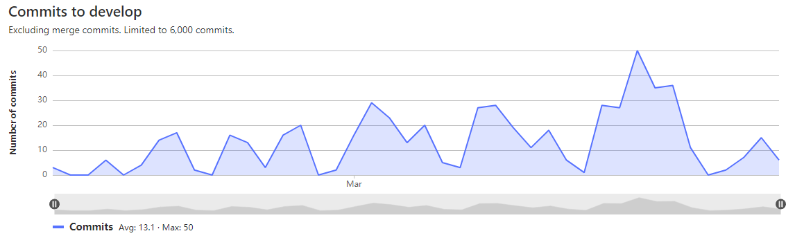
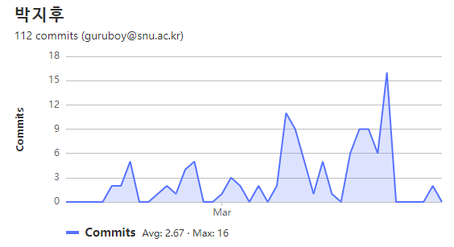
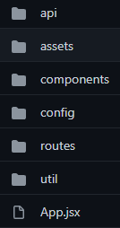

# Project Note : 회고 

7주간 진행했던 프로젝트가 마무리되었다. 

프로젝트 기간 동안 진행한 작업, 작성한 코드와, 어려웠던 문제에 대해 정리해보려고 한다. 


## 프로젝트 기획 및 소개 

- 주식 자동매매 서비스를 기획하였으나..  
  - 자동매매의 경우, 주식 거래에 흔히 이용되는 증권사의 거래 API 에 직접 접근해야 했는데, 이 부분은 시간이 많이 필요한 작업이었다. 
  - 또한, 고객의 주식을 대신 매매해주는 행위에는 특정 자격이 필요했다. 
  - 따라서, 위의 기술적, 법적 한계로 인해 결국 방향을 바꾸게 되었다.
- 서비스에 대한 자세한 소개와 기획 의도는 [JRStock README.md](https://expensive-treatment-cae.notion.site/README-f6fa4bf0cb8e4ec29a0109401db87619) 참고!


## Git 

Team Commits 




My Commits 

 

이번 프로젝트에선, 최대한 작업 단위를 작게 나누어 여러 번 커밋을 남기려고 노력했다. 

- but 하루 동안 이것 저것 개발하다가, 결국 하루 마지막에 몰아서 커밋을 남기는 경우가 허다했다. 
- 다음엔 이런 부분을 더더욱 신경써야 할 것 같다. 

git flow 전략을 모방하여 진행했고, 하루 끝에 프론트엔드 개발 인원이 모두 모여 merge 를 진행했다.


Git convention

- 브랜치 명은  `feature/FE-backtest` , `hotfix/FE-mypage` 과 같이 작성했다. 

- Gitlab 과 Jira 를 연동하여 커밋 메시지에 티켓 아이디를 포함하여 다음과 같이 작성하였다. 

  `#S06P21S001-356 feat: Edit annual profit explanation`


## Jira 

스프린트를 1주 단위로 진행하였으며, 모든 이슈를 완료하는 것을 목표로 했다. 

Epic > Story > Task 단위로 이슈를 생성하고, 주 40시간을 기준으로 스토리 포인트를 부여했다. (이슈 당 최대 4 )

Task 는 작은 작업 단위로, 조금 더 범위가 큰 Story 에 연결하였다. 

저번 공통 프로젝트에선, Epic > Story > sub-task 단위로 진행하였는데, 작업 단위를 너무 작게 쪼개는 느낌이 들어 불편했고, sub-task 대신 Task 를 생성하여 Story 에 연결하는 편이 한 눈에 작업을 보기에도 편리하고 좋았다. 


## React 

 

Create-React-App 으로 시작하여, 구조를 그대로 따라갔다. 

`/api`

-  기능별로 구분하여, axios 인스턴스와 메서드를 작성한 js 파일을 모아두었다.   

- 이번 프로젝트에선, 3 가지 axios 인스턴스가 필요했다. 

  ```js
  import axios from "axios";
  import { API_BASE_URL } from "../config/index";
  
  function apiInstance() {
    const instance = axios.create({
      baseURL: API_BASE_URL,
      headers: {
        "Content-type": "application/json",
      },
    });
    return instance;
  }
  function fileApiInstance() {
    const instance = axios.create({
      baseURL: API_BASE_URL,
      headers: {
        "Content-type": "multipart/form-data",
      },
    });
    return instance;
  }
  function loginApiInstance() {
    const jwtToken = sessionStorage.getItem("access_token");
    const instance = axios.create({
      baseURL: API_BASE_URL,
      headers: {
        "Content-type": "application/json",
        Authorization: `Bearer ${jwtToken}`,
      },
    });
    return instance;
  }
  
  export { apiInstance, loginApiInstance, fileApiInstance };
  ```

- 아래와 같은 방식으로 인스턴스를 불러와 요청을 보낸다. 

  ```react
  // 회원 정보 수정
  async function userUpdate(id, userInfo) {
    const loginApi = loginApiInstance();
    return (
      await loginApi.put(`/user/update/${id}`, userInfo, {
        headers: {
          "Content-Type": `multipart/form-data`,
        },
      })
    ).data;
  }
  ```

`/components` : 기능 혹은 page 단위로 분류하여 구조화하였다. 

- 이번 프로젝트에서 컴포넌트의 모듈화와 코드 중복 부분은 많이 미흡했다.
- CSS 작성에도 많은 아쉬움이 남는다. tailwind CSS 를 사용했는데, 이제 많이 익숙해 진 탓인지 더 이상 CSS 라이브러리가 필요치 않을 것 같다. 
- 또한 저번 공통 프로젝트와는 다르게 module.css 를 사용하지 않은 부분도 많이 아쉽다. 
- 다음 번엔 styled component 를 사용해보고 싶다. 

`/config` : 백엔드 API URL 이나, 종목 백테스트 생성 시 사용되는 기본 값들을 설정해 둔 backtestConfig.js 파일이 존재한다. 

```js
// 예시 
export const strategies = {
  1: "이동평균선(MA)",
  2: "이동평균수렴확산지수(MACD)",
  3: "상대적강도지수(RSI)",
  4: "누적평균거래량(OBV)",
  5: "자금흐름지표(MFI)",
  6: "일목균형표",
  7: "코스피지수",
  8: "코스닥지수",
};

export const details = {
  1: "상향돌파",
  2: "하향돌파",
  3: "골든크로스(golden cross)",
  4: "데드크로스(dead cross)",
  5: "정배열",
  6: "역배열",
  7: "높음",
  8: "낮음",
};
```

`/routes` : `<Route>` 가 렌더링 하는 컴포넌트들이 존재한다. 

`/util`  : 백엔드 에서 받아온 데이터를 가공하는 함수들을 담은 js 파일과, `useSessionToken`, `useIsLoggedIn` 과 같은 커스텀 훅이 존재한다. 


