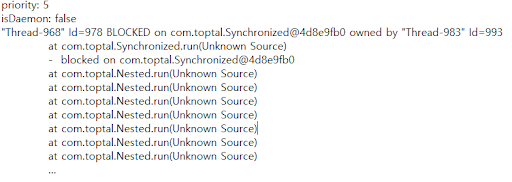

# Project Note: kafka producer

Java Agent 에 kafka producer 코드를 추가하여, thread dump 데이터가 topic 으로 잘 전송되는지 확인하였다. 

작성한 producer 메서드 코드는 다음과 같다. 

```java
private void sendThreadDumps (String message) {
    Properties configs = new Properties();
    try {
        configs.put("client.id", InetAddress.getLocalHost().getHostName());
    } catch (UnknownHostException e) {
        throw new RuntimeException(e);
    }
    // 카프카 브로커의 주소 목록은 2개 이상의 ip 와 port 를 설정하도록 권장하고 있다.
    configs.put("bootstrap.servers", "localhost:9092");
    // 나머지 key, value 에 대해 직렬화 설정
    configs.put("key.serializer",
                "org.apache.kafka.common.serialization.StringSerializer");
    configs.put("value.serializer",
                "org.apache.kafka.common.serialization.StringSerializer");
    // 카프카 프로듀서 인스터스 생성
    KafkaProducer< String, String > producer = new KafkaProducer < String,
    String >(configs);
    // 카프카가 제공하는 전송 객체 사용
    // final ProducerRecord<K, V> record = new ProducerRecord<>(topic, key, value);
    // final ProducerRecord<K, V> record = new ProducerRecord<>(topic, value);
    ProducerRecord<String, String> record = new ProducerRecord < String, String >
        ("test-topic", message);
    // send() API returns a future which can polled to get result of send()
    Future<RecordMetadata> future = producer.send(record);
    producer.close();
}
```

- `message` 를 parameter 로 받아, `test-topic` 이라는 이름의 토픽으로 전송한다. 
- 이를 위해 미리 kafka 서버를 실행하고 `test-topic` 토픽을 생성해 두었다. 

Thread dump 데이터를 얻은 코드는 아래와 같다. 

```java
private void printThreadsDump(PrintStream stream, Map<Thread, StackTraceElement[]> threads)
{
    ThreadMXBean mxBean = ManagementFactory.getThreadMXBean();
    String pid = ManagementFactory.getRuntimeMXBean().getName().replaceAll("[^\\d.]", "");
    String message = pid + "\n";
    try {
        for (Thread thread : threads.keySet()) {
            StackTraceElement[] stacktrace = threads.get(thread);
            long[] ids = { thread.getId() };
            ThreadInfo[] info = mxBean.getThreadInfo(ids, true, true);
            message += "priority: " + thread.getPriority() + "\n";
            message += "isDaemon: " + thread.isDaemon() + "\n";
            message += info[0] + "\n";
        }
    } catch (NullPointerException e) {
        System.out.println(e.toString());
    }
    sendThreadDumps(message);
}
```

- `ThreadMXBean`, `ThreadInfo` 와  `Thread` 객체를 통해 얻은 정보들을 `message` 에 담아 `sendThreadDumps()` 메서드에 인자로 넘긴다. 

- 로컬에서 `kafka-console-consumer` 를 통해 토픽에 저장된 데이터를 확인할 수 있었다. 



- Thread Dump format 이 별로 깔끔하진 않지만, 일단 이 정도 정보를 얻을 수 있는 데서 만족했다. 

  - pid, thread name / id / priority / isDeamon / state / lockinfo 등을 담고 있다. 

   
