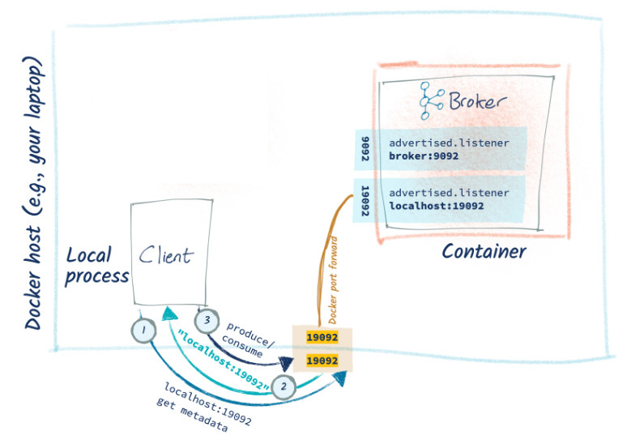

# Project Note: Dockerize Kafka

Docker 를 이용해 Kafka 서버를 실행하였다. 

> [wurstmeister/kafka-docker](https://github.com/wurstmeister/kafka-docker)

- 위 kafka docker image 를 사용하여 실행하였다. 

위 repository 를 clone 받은 뒤, 필요한 `docker-compose` 파일을 실행하면 된다. 

나의 경우

- single broker 환경이면 충분했기 때문에  `docker-compose-single-broker.yml` 을 이용하였다. 

- 제공받은 AWS EC2 서버가 9000번 이상의 포트를 허용하고 있지 않았기 때문에, kafka 기본 지정 포트인 9092번 포트를 사용할 수 없었다. 따라서 port 를 변경해주고, 외부 서버에서도 연결이 가능하도록 docker-compose 파일을 수정하였다. 

수정한 결과는 아래와 같다.

```yml
version: "2"
services:
  zookeeper:
    image: wurstmeister/zookeeper
    ports:
      - "2181:2181"
  kafka:
    build: . # use wurstmeister/kafka-docker Dockerfile
    ports:
      - "8092:9092" # host 8092 port => docker 9092 port
    environment:
      KAFKA_ADVERTISED_HOST_NAME: 172.26.11.153 # k6s102.p.ssafy.io (ip address)
      KAFKA_CREATE_TOPICS: "json_log:1:1" # topic_name:partition:replica
      KAFKA_ZOOKEEPER_CONNECT: zookeeper:2181
    volumes:
      - /var/run/docker.sock:/var/run/docker.sock
```

- host port 를 9092 에서 8092 로 바꾸었고, 외부 접속을 위한 프로커 주소를 설정하였다. 
- 그러나.. 동일한 EC2 서버 내에서는 `kafka-console-producer` 와 `kafka-console-consumer` 를 통해 연결이 잘 되는 것을 테스트 가능했는데, 로컬에서 테스트 할 때는 서버의 카프카에 연결이 불가했다..

사실 위 방법을 이용하기 전에, 다른 여러 docker-compose 파일들을 시도해봤는데, 모두 연결이 안되는 같은 문제가 있었다. 

위부에서 접속을 가능토록 하려면, 일반적으로 `config/server.properties` 의 `advertised.listener` 의 주소를 변경하거나, `docker-compose` 파일에서는 `KAFKA_ADVERTISED_HOST_NAME` 을 변경하는 것으로 보이는데, 정확한 이해가 없던 탓인지 단순히 변경한다고 해결이 되지 않았다. 

따라서 stack-overflow 에 아래와 같은 질문을 올리게 되었다 . 

>[Can't connect to dockerized kafka (used wurstmeister/kafka-docker) from outside the server](https://stackoverflow.com/questions/72111746/cant-connect-to-dockerized-kafka-used-wurstmeister-kafka-docker-from-outside)

친절한 답변은 아니었지만, 누군가 답변으로 글을 하나 추천해주었는데, 예전에 한 번 슬쩍 본 글이었지만 크게 도움을 받지 못했던 글이었다. 그러나 내가 제대로 이해를 못한 부분이 많은 것 같아 제대로 다시 읽어보기로 하였다..

>[My Python/Java/Spring/Go/Whatever Client Won’t Connect to My Apache Kafka Cluster in Docker/AWS/My Brother’s Laptop. Please Help!](https://www.confluent.io/blog/kafka-client-cannot-connect-to-broker-on-aws-on-docker-etc/)

- 결국엔, `advertised.listener` 를 접근 가능한 ip 주소로 설정해주어야 한다는 내용인 것 같다!

또한 scenario 4 의 경우엔, 클라이언트가 로컬에서 실행되는 경우, 도커 네트워크가 없이 연결이 필요한데, 이 경우 listener 를 하나 더 추가해주어야 하는 것으로 보인다.  



