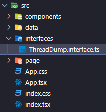

# Project Note: TypeScript 

처음으로 타입스크립트를 사용하여 프론트엔드 개발을 진행하였다. 


###### 메모 2022-05-07

----

`src` 폴더 아래에 `interfaces` 폴더를 생성하여, 관련된 인터페이스를 모아두는데 사용하였다. 



----

인터페이스 타입을 가지는 객체의 키에 아래와 같이 `string` 으로 접근하려면.. 

```typescript
export const dummyThread: ThreadInfo = {
  count: 100,
  threadState: {
    BLOCKED: 20,
    RUNNABLE: 40,
    WAITING: 30,
    TIMED_WAITING: 10,
  },
};

const stateCount = threadInfo.threadState[state] // state 는 string 

// ... 
// interfaces
export interface ThreadInfo {
  count: number;
  threadState: ThreadState;
}

interface ThreadState {
  [index: string]: number; // 다음과 같은 속성을 추가해주어야, 키를 string 으로 접근 가능하다. 
  BLOCKED: number;
  RUNNABLE: number;
  WAITING: number;
  TIMED_WAITING: number;
}

```


위와 같이 인터페이스에 추가로 작성이 필요하다. 

  


