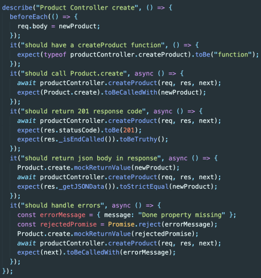

# React test: 02 Jest

>[인프런: 따라하며 배우는 리액트 테스트 by John Ahn](https://www.inflearn.com/course/%EB%94%B0%EB%9D%BC%ED%95%98%EB%8A%94-%EB%A6%AC%EC%95%A1%ED%8A%B8-%ED%85%8C%EC%8A%A4%ED%8A%B8)

- 위 강의를 듣고 정리한 내용입니다. 

## Create React App 

1. Babel 

   > Babel is a toolchain that is mainly used to convert ECMAScript 2015+ code into a backwards compatible version of JavaScript in current and older browsers or environments.

   최신 자바스크립트 문법을 지원하지 않는 구형 브라우저를 위해, 코드를 변환해준다. 

2. Webpack 

   > At its core, **webpack** is a *static module bundler* for modern JavaScript applications. When webpack processes your application, it internally builds a [dependency graph](https://webpack.js.org/concepts/dependency-graph/) from one or more *entry points* and then combines every module your project needs into one or more *bundles*, which are static assets to serve your content from.


`npm` vs `npx`

`npm install -g create-react-app` 

- global 디렉토리에 다운받는다. 

`npx create-react-app <프로젝트 이름>` 

- npx 가 npm registry 에서 create-react-app 을 찾아서 다운로드 없이 실행시켜준다.   
- Disk Space 를 낭비하지 않고, 항상 최신 버전을 사용할 수 있다. 

## Jest

### What is Jest

Jest 는 FaceBook 에 의해 만들어진 테스팅 프레임워크로, 최소한의 설정으로 동작하며 Test Case 를 만들어서 어플리케이션 코드가 잘 돌아가는지 확인해준다. 단위(Unit) 테스트를 위해서 이용한다. 

페이스북에서는 Jest를 단순한 테스팅 라이브러리가 아닌 “테스팅 프레임워크”라고 부른다. 

- Jest 이전에는 자바스크립트 코드를 테스트를 위해 여러가지 테스팅 라이브러리를 조합해서 사용. 
  - ex) Mocha나 Jasmin을 Test Runner로 사용하고, Chai나 Expect와 같은 Test Mathcher를 사용했으며, 또한 Sinon과 Testdouble 같은 Test Mock 라이브러리도 필요했음
  - 이 라이브러리들은 굉장히 유사하지만 살짝씩 다른 API를 가지고 있었기 때문에 혼란을 줌. 
  -  Jest는 라이브러리 하나만 설치하면, Test Runner와 Test Mathcher 그리고 Test Mock 프레임워크까지 제공


### How

CRA 에 의해 바로 사용이 가능하도록 설치가 된다. 

Jest 는 아래 구조로 된 Test 파일을 찾는다. 

- `/test/*` : All files inside tests folders

- `{filename}.test.js`
- `{filename}.spec.js`


#### Jest 파일 구조 



1. `describe` : 여러 관련 테스트를 그룹화하는 블록을 만든다. 

2. `test` or `it` : 개별 테스트를 수행하는 곳, 각 테스트를 작은 문장으로 설명한다. 

3. `expact` & `matcher` : expect 함수는 값을 테스트할 때마다 사용되며, matcher 를 통해 값을 각각 다른 방법으로 테스트할 수 있다. 

   ```js
   test('two plus two is four', () => {
       expect(2 + 2).toBe(4); // matcher: `toBe()`
   })
   
   test('two plus two is not five', () => {
       expect(2 + 2).not.toBe(5); // matcher: `not.toBe()`
   })
   ```


## test 실습

```bash
npx create-react-app react-test-app 

cd react-test-app 

npm test

# commands 
Watch Usage
 › Press a to run all tests.
 › Press f to run only failed tests.
 › Press q to quit watch mode.
 › Press p to filter by a filename regex pattern. 
 › Press t to filter by a test name regex pattern.
 › Press Enter to trigger a test run.
```

CRA 를 통해 기본적으로 `App.test.js` 가 생성된다. 

```js
import { render, screen } from '@testing-library/react';
import App from './App';

test('renders learn react link', () => {
  render(<App />);
  const linkElement = screen.getByText(/learn react/i);
  expect(linkElement).toBeInTheDocument();
});
```

- `render()` : DOM 에 컴포넌트를 렌더링 하는 함수

  - 인자로 렌더링할 React 컴포넌트를 넣는다. 

  - RTL 에서 제공하는 쿼리 함수와 기타 유틸리티 함수를 담고 있는 객체를 리턴한다. 

    ```js
    // not recommended
    test('renders learn react link', () => {
      const { getByText } = render(<App />);
      const linkElement = getByText(/learn react/i);
      expect(linkElement).toBeInTheDocument();
    });
    ```

    - Destructuring 문법으로 원하는 쿼리 함수만 얻어온다. 그러나 코드가 복잡해지면 사용해야 할 쿼리가 많아지므로, screen 객체를 이용하는 것이 좋다. 

- `toBeInTheDocument()` matcher : element 가 document 에 존재하는지 

  > [custom jest-dom mathcers](https://github.com/testing-library/jest-dom)


## Queries 

> [RTL - Core API - Queries](https://testing-library.com/docs/queries/about)
>
> 쿼리 함수란, 페이지에서 요소를 찾기 위해 테스트 라이브러리가 제공하는 방법으로, 여러 유형의 쿼리 ('get', 'find', 'query') 가 있다. 이들 간의 차이점은 요소가 발견되지 않으면 쿼리에서 오류가 발생하는지, 또는 Promise 를 반환하고 다시 시도하는 지 여부에 있다. 선택하는 페이지 콘텐츠에 따라 적절한 쿼리를 사용해야 한다. 

1. `getBy`

   쿼리에 대해 일치하는 `노드`를 반환하고, 일치하는 요소가 없거나 둘 이상의 일치가 발견되면 `오류`를 발생시킨다. 

   둘 이상의 요소가 예상되는 경우엔 `getAllBy` 를 사용한다. 

2. `queryBy `

   쿼리에 대해 일치하는 `노드`를 반환하고, 일치하는 요소가 없으면 `null` 을 반환한다. 이는 존재하지 않는 요소를 asserting 하는데 유용하다. 둘 이상의 일치 항목이 발견되면 오류가 발생한다. (`queryByAllBy` 를 대신 사용)

3. `findBy` 

   주어진 쿼리와 일치하는 요소가 발견되면 resolve 하는 `Promise` 를 반환한다. 요소가 발견되지 않거나 기본 시간 제한인 1000ms 이후에 둘 이상의 요소가 발견되면 `Promise` 가 reject 된다. 둘 이상의 요소를 찾을 때는 `findAllBy` 를 사용한다. 

   `findBy` 는 `getBy`  와 `waitFor` 의 조합이다. 

`waitFor `는 일정 기간 동안 기다리도록 하여, 기대가 통과할 때까지 기다릴 수 있다. 

| Type of Query         | 0 Matches     | 1 Match        | >1 Matches   | Retry (Async/Await) |
| --------------------- | ------------- | -------------- | ------------ | ------------------- |
| **Single Element**    |               |                |              |                     |
| `getBy...`            | Throw error   | Return element | Throw error  | No                  |
| `queryBy...`          | Return `null` | Return element | Throw error  | No                  |
| `findBy...`           | Throw error   | Return element | Throw error  | Yes                 |
| **Multiple Elements** |               |                |              |                     |
| `getAllBy...`         | Throw error   | Return array   | Return array | No                  |
| `queryAllBy...`       | Return `[]`   | Return array   | Return array | No                  |
| `findAllBy...`        | Throw error   | Return array   | Return array | Yes                 |


## 개발 환경 설정 추가 

### ESLint + Prettier

- ESLint 는 개발자들이 특정한 규칙을 가지고 코드를 깔끔하게 짤 수 있도록 도와주는 라이브러리로,

  자바스크립트 작성 가이드라인을 제시하고 문법에 오류가 나면 알려주는 역할을 한다. 

- Prettier 는 주로 코드 형식을 맞추는 데 사용하며, 따옴표, Indent 등의 규칙을 설정하여 코드 포맷터 역할을 한다. 

CRA 로 리액트 프로젝트를 시작하면, 기본 eslint 설정이 되어 있지만 앱을 시작했을 때 터미널 상에서 에러를 확인 가능하다.  VSCode ESLint extension 를 사용하면, 앱 실행 전에 에러 감지가 가능하다. 


#### ESLint Testing Plugins

eslint 에서 기본으로 제공하지 않는 다양한 규칙을 플러그인을 통해 사용 가능하다. `eslint-plugin-react`, `eslint-plugin-react-hooks` 등이 있다. 

테스팅을 위해서는 

```bash
npm install eslint-plugin-testing-library # render() DOM
npm install eslint-plugin-jest-dom # expect matcher test
```

`package.json` 에서 `eslintConfig` 부분을 제거하고 `.eslintrc.json` 을 통해 설정을 해주자.

```json
{
  "plugins": ["testing-library", "jest-dom"],
  "extends": [
    "react-app",
    "react-app/jest",
    "plugin:testing-library/react",
    "plugin:jest-dom/recommended"
  ]
}
```

아래와 같이 코드 작성 시, eslint 에 의해 에러가 발생한다. 

```js
const linkTest = screen.getByRole("button", {
    name: "lintTest",
});

expect(linkTest.textContent).toBe("lintTest");
// Use toHaveTextContent instead of asserting on DOM node attributeseslintjest-dom/prefer-to-have-text-content
// => expect(linkTest).toHaveTextContent("lintTest"); 
```

