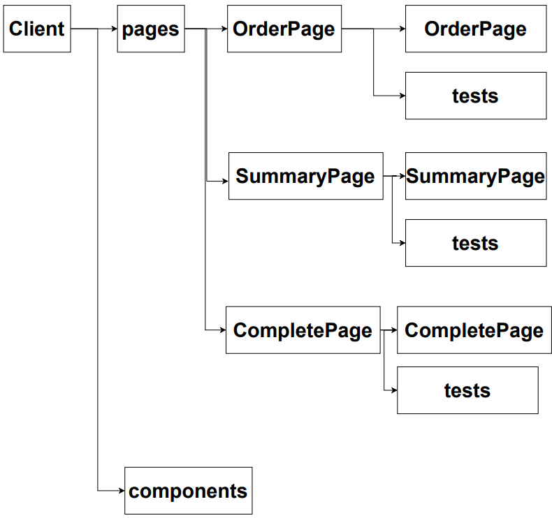
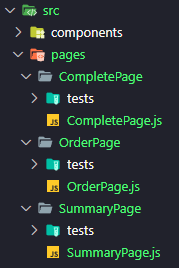

# React test: 04  practice

>[인프런: 따라하며 배우는 리액트 테스트 by John Ahn](https://www.inflearn.com/course/%EB%94%B0%EB%9D%BC%ED%95%98%EB%8A%94-%EB%A6%AC%EC%95%A1%ED%8A%B8-%ED%85%8C%EC%8A%A4%ED%8A%B8)

- 위 강의를 듣고 정리한 내용입니다. 


## Create product ordering app 

여행 상품 주문 앱을 만들며 테스트 해보자. 

#### environment

- Create React App 

- ESLint plugins : `eslint-plugin-jest-dom`, `eslint-plugin-testing-library`

  - `.eslintrc.json`

  - test 

    ```js
    const lintTest = screen.getByRole("button", {
      name: "lintTest",
    });
    
    expect(lintTest).toHaveTextContent("lintTest");
    ```


### architecture

 


## 구현

### SummaryPage Form 

1. 해야할 일 작성 => `주문 확인 체크 박스를 눌러야만 주문 확인 버튼을 누를 수 있다. `

2. 테스트 작성 

   ```js
   test("checkbox and button", () => {
     render(<SummaryPage />);
     const checkbox = screen.getByRole("checkBox", {
       name: "주문하려는 것을 확인하셨나요?",
     });
     expect(checkbox.checked).toEqual(false);
   
     const confirmButton = screen.getByRole("button", {
       name: "주문 확인",
     });
     expect(confirmButton.disabled).toBeTruthy();
   });
   
   ```

3. 테스트 실행 => Fail 

4. 테스트에 대응하는 실제 코드 작성 

   ```js
   const SummaryPage = () => {
     const [checked, setChecked] = useState(false);
     return (
       <div>
         <form>
           <input
             type="checkbox"
             checked={checked}
             id="confirm-checkbox"
             onChange={(e) => setChecked(e.target.checked)}
           />
           <label htmlFor="confirm-checkbox">주문하려는 것을 확인하셨나요?</label>
           <br />
           <button disabled={!checked} type="submit">
             주문 확인
           </button>
         </form>
       </div
   ```

5. 테스트 실행 => Pass


### OrderPage 

 Products 와 Options 를 백엔드 서버에서 가져온 뒤, 총 가격을 계산해준다. 


#### Mock Service Worker

>[MSW Docs](https://mswjs.io/docs/)

백엔드에서 데이터를 가져오는 부분을 테스트하기 위해선, 실제로 서버에 호출하는 end-to-end 테스트도 가능하지만, 

Mock Service Worker 를 통해 서버에 보낸 요청을 가로채서, 요청을 처리하고 모의 응답 (mocked response) 를 보내줄 수 있다. 


브라우저에 Service Worker 를 등록하여, 외부로 나가는 network request 를 감지한다. 그리고 그 요청을 실제 서버로 갈 때 중간에 intercept 하여 MSW 클라이언트 사이드 라이브러리로 보낸다. 그 후 등록된 핸들러에서 요청을 처리한 후 모의 응답 (mockedResponse) 를 브라우저로 보낸다.


#### How?

1. install 

   ```bash
   npm install msw
   ```

2. 핸들러 생성 

   `src/mocks/handlers.js`

   Handler Type (Rest or GraphQL) + HTTP Method (GET, POST ...)

   ```js
   import { rest } from "msw";
   
   export const handlers = [
     rest.get("https://localhost:5000/products", (req, res, ctx) => {
       return res(
         ctx.json([
           {
             name: "America",
             imagePath: "/images/america.jpeg",
           },
           {
             name: "England",
             imagePath: "/images/england.jpeg",
           },
         ])
       );
     }),
     rest.get("https://localhost:5000/options", (req, res, ctx) => {
       return res(
         ctx.json([
           {
             name: "Insurance",
           },
           {
             name: "Dinner",
           },
         ])
       );
     }),
   ];
   
   ```

공통적으로 핸들러를 생성을 해주어야 한다. 

이후 방법은 두가지로 나뉜다. 

1. 브라우저와 통합

2. 노드와 통합 (Jest 사용하는 테스트 환경)

   - 서버 생성: `src/mocks/server.js`

     ```js
     import { setUpServer } from "msw/node";
     import { handlers } from "./handlers";
     
     // mocking server 생성
     export const server = setUpServer(...handlers);
     ```

   - API mocking 설정: setupTest.js

     ```js
     import { server } from "./mocks/server";
     
     beforeAll(() => server.listen());
     afterEach(() => server.resetHandlers());
     afterAll(() => server.close());
     ```

     

#### Test 

Mock Service Workder 를 이용하여 여행 상품 부분을 테스트해보자. 

1. Type 파일 생성
2. Type.test.ts 파일 생성
3. Products 파일 생성

#### 01 

1. 해야할 일 작성 => `서버에서 여행 상품 이미지를 가져온다. `

2. 테스트 작성 

   ```js
   import Type from "../Type";
   import { render, screen } from "@testing-library/react";
   
   test("displays products images from server", async () => {
     render(<Type orderType="products" />);
   
     // 이미지 찾기
     const productImages = await screen.findAllByRole("img", {
       name: /product$/i,
     });
     expect(productImages).toHaveLength(2);
   
     const altText = productImages.map((element) => element.alt);
     expect(altText).toEqual(["America product", "England product"]);
   });
   
   ```

3. 테스트 실행 => Fail

4. 테스트에 대응하는 실제 코드 작성

   ```html
   <div className="App">
     <header className="App-header">
       <h3 data-testid="counter">{count}</h3>
       <div>
         <button data-testid="minus-button">-</button>
         <button data-testid="plus-button">+</button>
       </div>
     </header>
   </div>
   ```

5. 테스트 실행 => Pass

