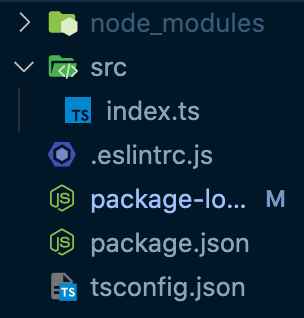

# TypeScript: practice 01

> [타입스크립트 입문](https://www.inflearn.com/course/%ED%83%80%EC%9E%85%EC%8A%A4%ED%81%AC%EB%A6%BD%ED%8A%B8-%EC%9E%85%EB%AC%B8/)

- 위 강의를 듣고 정리한 내용입니다. 

>[강의 project source code](https://github.com/joshua1988/learn-typescript)

## 프로젝트 구조 

`tsconfig.json` 

- `"noImplicitAny": true` 로 변경 시, 기존 코드는 기본적인 warning 이 아니라 error 를 표시하게 된다. 

`package.json`

- [npm 소개](https://joshua1988.github.io/webpack-guide/build/node-npm.html#npm) 참고 

- `npm init -y` : 프로젝트 초기화 명령어 
- `babel`, `prettier`, 등 `devDependencies` 가 정의되어 있다. 
  - typescript 를 보조하고 있는, 규칙을 인지하고 있는 `.eslintrc.js` 를 사용하기 위해 필요한 패키지들이 명시 

## 실습 

처음 자바스크립트를 타입스크립트로 재작성할 때, `any` 타입으로 지정해 둔 뒤 차근차근 구체적인 타입을 작성하는 방법을 많이 사용한다. 

에러가 있을 경우, 컴파일이 불가능하므로, 에러가 없도록 `1_todo` 프로젝트를 수정해보자!

