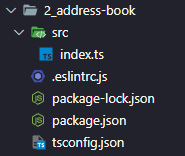

# TypeScript: practice 02

> [타입스크립트 입문](https://www.inflearn.com/course/%ED%83%80%EC%9E%85%EC%8A%A4%ED%81%AC%EB%A6%BD%ED%8A%B8-%EC%9E%85%EB%AC%B8/)

- 위 강의를 듣고 정리한 내용입니다. 

>[강의 project source code](https://github.com/joshua1988/learn-typescript)

## 프로젝트 구조 

 

- 간단!

- `tsconfig.json` 수정

  ```json
      "noImplicitAny": true,
      "strict": true,
      "strictFunctionTypes": true
  ```

- `.eslintrc.js` 수정 

  ```js
      // '@typescript-eslint/no-explicit-any': 'off',
      // "@typescript-eslint/explicit-function-return-type": 'off',
  ```

  

## 실습 

아래 `index.ts` 의 메서드 타입을 정의해보자 

###### Promise 

Promise 는 기본적으로 Generic 으로 타입을 정의한다. 

```typescript
function fetchItems() {
    let items = ['a', 'b', 'c']l
    return new Promise(function (resolve, reject) {
        resolve(items);
    })
} // return Promise<unknown>
```

```typescript
function fetchItems(): Promise<string[]> {
    let items = ['a', 'b', 'c']l
    return new Promise(function (resolve, reject) {
        resolve(items);
    })
}
```


###### Enum 활용 

```typescript
// phoneType 은 home, office, studio 셋 중 하나 
findContactByPhone(phoneNumber: number, phoneType: string): Contact[] {
    return this.contacts.filter(
        (contact) => contact.phones[phoneType].num === phoneNumber
    );
}

// 오탈자가 있는 상황에 대비할 수 없다. 
findContactByPhone('officce');
findContactByPhone('homme');
```

따라서 

```typescript
enum PhoneType {
    Home = 'home', 
    Office = 'office', 
    Studio = 'studio'
}

findContactByPhone(phoneNumber: number, phoneType: PhoneType): Contact[] {
    return this.contacts.filter(
        (contact) => contact.phones[phoneType].num === phoneNumber
    );
}

findContactByPhone(PhoneType.Home);
```


