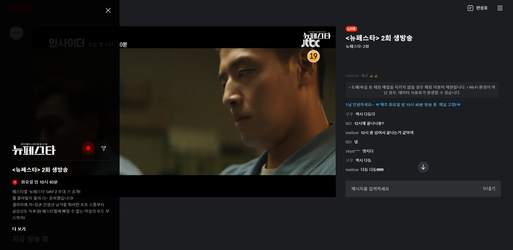

# 자소서 

## 당근마켓 썸머인턴  

 특정 기능의 구현을 넘어서서 더 고민해보거나 신경써서 개선해본 경험이 있다면 알려주세요. 사소한 것도 괜찮아요 (250자)

모의투자 서비스의 프론트엔드 개발을 할 때, 사용자 경험 향상을 위해 비동기적 처리를 진행한 경험이 있습니다. 사용자가 20년 동안의 모든 일일 주가 데이터에 대해 모의투자를 진행할 시, 백엔드에서 이를 처리하여 응답하기까지 1분 이상의 시간이 소요되었습니다. 이 때,  아직 모의투자의 결과가 나오지 않은 경우에도, 사용자가 종목 정보 확인과 같은 다른 서비스를 이용할 수 있도록 하여, 긴 시간 로딩 화면에서 대기하지 않도록 개발하였습니다. 

=> STAR 형식을 좀 따를 걸 그랬다.. 

## 네이버 인턴 

> [필수] 지원동기는 무엇인가요? 어떤 업무를 하고 싶은지 구체적으로 기술해주시기 바랍니다.

제가 진행한 프로젝트와 기술 경험을 동원하여 NOW의 서비스를 개선하는 데 도움이 되는 업무를 하고 싶습니다. 여러 인턴 직무를 확인하면서 TUNE CIC 팀의 NOW 서비스에 대해 알게 되었고, 직접 사용해보았습니다. 
(1) 데스크탑 환경에선 크롬 웹 브라우저를 통해,  (2) 모바일 환경에선 개인 아이폰을 이용해 사파리 브라우저에서의 동작을 확인했습니다. 이를 통해 반응형 레이아웃 상에 몇 가지 불편한 점들을 발견하게 되었습니다.
(1) 먼저 데스크탑 환경에선, 방송화면 좌측에 방영되고 있는 프로그램에 대한 정보가 존재합니다. 방송되는 화면의 비율에 따라, 프로그램 정보가 반응형으로 브라우저 너비에 따라 각각 다른 방식으로 표현되는데, 이때 공간을 사용하는 방식이 비효율적으로 느껴졌습니다. 특히 프로그램 제목과 상세 정보의 위쪽 공간에 큰 여백이 존재하는 부분이 개선이 필요하다고 느꼈습니다. 
(2) 모바일 웹 환경에서는, 가로로 긴 방송을 시청할 때, 채팅창과 방송화면 사이의 빈 공간이 많이 존재하게 되는데, 이때 채팅창을 위쪽으로 더 넓게 사용할 수 있도록 한다면 채팅창을 보는데 좀 더 수월할 것이라 느꼈습니다. 
따라서 저는 이번 인턴 실습을 하게 된다면, 이러한 웹 환경에서의 반응형 레이아웃에 따라 남게되는 빈 공간들을 효율적으로 사용할 수 있는 방법을 모색하고, 적용하는 업무에 도전해보고 싶습니다!

위 설명에 대한 캡처 자료를 첨부하겠습니다. 

방송되는 화면의 비율이 각각 다르다보니, 

방송을 볼 때, 왼쪽에 방영되고 있는 프로그램에 대한 정보가 각각 다르게 표시되는데, 가로로 긴 비율을 가진 방송의 경우 이 프로그램의 정보를 보여줄 때 상단 부분의 공간을 효율적으로 사용하지 못한다는 생각을 가지게 되었습니다. 

>[필수] 본인이 보유한 기술과 해당 기술의 활용정도를 모두 적어주세요. 
>
>- ex) Android - 상, JAVA - 상
>
>* 활용정도 
>  * 상 - 서비스 환경에 맞춰 최적화를 수행할 수 있는 높은 수준의 기술을 보유하고 있음. . 
>  * 중 - 주요 이슈 트러블슈팅을 할 수 있을 정도로 내부 구조에 대해 이해하고 있음. . 
>  * 하 - 코드를 읽을 수 있으며, 기본적인 기능을 구현할 수는 있음.

>[필수] 지원분야와 관련하여 본인의 기술력을 보여줄 수 있는 활동내역을 모두 기재해주세요. 
>
>* 활동예시 : 논문, 특허, 프로젝트, 창업, 오픈소스 코드 사이트 등 
>* 작성항목(활동별로 아래 항목에 맞춰 각각 기재) 
>  1. 진행기간 
>  2. 주요내용 
>  3. 본인이 기여한 점 
>  4. 사용한 기술스택 및 지식 
>  5. 결과 및 성과(서비스 URL 있으면 포함)

