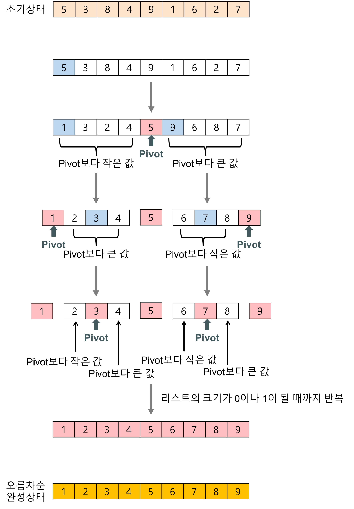

# interview questions : huinno

- 지원 동기 

## 기술

알고리즘 

- 아래와 같은 정렬 방식이 있는데, 이를 어떻게 구현할 수 있는지 설명 (분할정복 언급이 중요해보임)

- >numbers 배열이 주어진다. 배열의 원소들을 순서대로 조합하여 가장 큰 수가 되는 경우를 찾는 문제 
  >
  >ex) `[22, 6, 30]` => `[22630, 22306 ..., 63022] ` => 답은 63022
  >
  >ex) [3, 10, 5] => 답은 5310
  >
  >어떻게 해결할 것인지 설명 

>JTDA 라는 프로젝트에서 자바 쓰레드 덤프 수집기를 개발했는데, 이게 왜 필요했나요?
>
>다른 툴을 사용하는게 더 좋아보이는데, 이게 필요한 특별한 이유가 있나요?
>
>프로세스와 쓰레드의 차이가 뭔가요?

> 프로젝트에 사용한 상태관리 라이브러리에 대해 설명해주세요
>
> Redux 의 Container 와 hook 방식 중 어떤 것을 사용했나요? 둘이 어떤 차이가 있나요? 

>앱 개발 플랫폼에 대해 아는게 있으면 설명해주세요 

## 프로젝트 

>설계 / 구현 / 테스트 에 어느 정도 비율을 두고 진행하는지 
>
>프로젝트 하면서 애자일 방법을 선택한 이유가 있는지 
>
>그렇지 않았다면 왜 전통적인 방법을 사용했는지

>비전공자인데, 프로세스 쓰레드 같은 전공 지식은 어디서 얻었나요

>프로젝트 하면서 자신과 잘 맞지 않았던 팀원이 있었는지. 
>
>결국 어떻게 되었는지, 잘 해결되었는지

> 프로젝트 하면서 자신이 양보했던, 희생했던 경험에 대해 설명

>자신이 정말 가혹하게 열심히 진행했던 프로젝트가 있다면 설명 
>
>그렇게 하고 나니 어떤 생각이 들었는지. 

>현재 자신의 발전을 위해 하고 있는 게 있나요

>최근에 관심있게 보는 기술 / 트렌드가 있나요 

>입사시, 도서 구입비가 지급되는데, 어떤 책을 구입할 건가요
